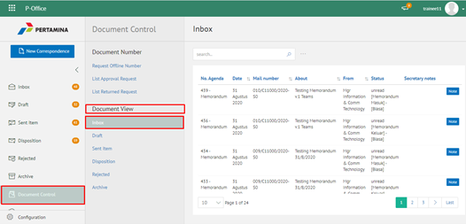

**Role yang sesuai**

- Sekretaris

Sekretaris dapat mencetak dokumen agenda kendali berdasarkan filter yang dipilih dalam format Excel. Langkah-langkah untuk mencetak dokumen agenda kendali adalah sebagai berikut

1. Klik menu **Document Control** dan pilih tab **Dokumen Masuk / Dokumen Keluar / Dokumen Disposisi**

2. Klik button **Filter** kemudian sistem menampilkan form filter dokumen yang akan dicetak

3. Pilih filter yang akan dicetak kemudian klik **Save**

4. Data akan tampil berdasarkan filter yang sudah dipilih kemudian klik tombol **Excel** untuk mencetak

## **P-Office Versi Teams**

Langkah - langkah untuk mencetak dokumen via Teams adalah sebagai berikut:

1. Klik menu **Document Control** dan pilih tab **Dokumen Masuk / Dokumen Keluar / Dokumen Disposisi**

2. Klik button **Filter** kemudian sistem menampilkan form filter dokumen yang akan dicetak

3. Pilih filter yang akan dicetak kemudian klik **Save**

4. Data akan tampil berdasarkan filter yang sudah dipilih kemudian klik tombol **Excel** untuk mencetak

