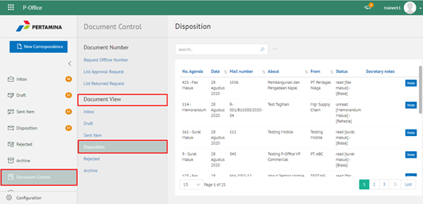

**Role yang sesuai**

- Sekretaris

Sekretaris dapat melihat daftar dokumen disposisi yang mencatatkan seluruh dokumen yang didisposisikan kepada jabatan atasan sekretaris

## **P-Office Versi Web**

Langkah – langkah untuk melihat daftar dokumen disposisi via Web adalah sebagai berikut

1. Klik menu **Document Control** dan pilih submenu **Document View - Disposisi**

2. Sistem menampilkan dokumen disposisi yang informasinya meliputi no agenda, tanggal, nomor surat, perihal, dari/asal, status dan *secretary notes*