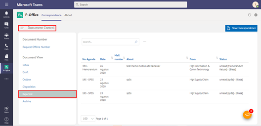

**Role yang sesuai**

- Sekretaris

Sekretaris dapat melihat daftar dokumen yang ditolak oleh atasan pejabat sekretaris tersebut

## **P-Office Versi Web**

Langkah - untuk melihat daftar dokumen dokumen yang ditolak via Web adalah sebagai berikut

1. Klik menu **Document Control** dan pilih submenu **Document View - Disposisi**

2. Sistem menampilkan dokumen disposisi yang informasinya meliputi no agenda, tanggal, nomor surat, perihal, dari/asal, status dan *secretary notes*

## **P-Office Versi Teams**

Langkah - langkah untuk melihat daftar dokumen tolak via Teams adalah sebagai berikut:

1. Klik menu **Document Control** dan pilih submenu **Document View - Rejected**

2. Sistem menampilkan dokumen disposisi yang informasinya meliputi no agenda, tanggal, nomor surat, perihal, dari/asal, status dan *secretary notes*