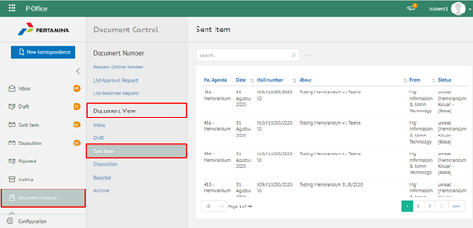

**Role yang sesuai**

- Sekretaris

Sekretaris dapat melihat daftar dokumen keluar (Outbox) yang mencatatkan seluruh dokumen yang keluar kepada jabatan atasan sekretaris.

## **P-Office Versi Web**

Langkah – langkah untuk melihat daftar dokumen (Outbox) via Web adalah sebagai berikut

1. Klik menu **Document Control** dan pilih submenu **Document View - Outbox**

2. Sistem menampilkan dokumen keluar yang informasinya meliputi no agenda, tanggal, nomor surat, perihal, dari/asal, status dan _secretary notes_

