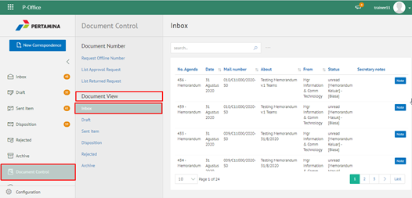
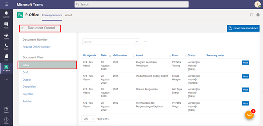

**Role yang sesuai**

- Sekretaris

Sekretaris dapat melihat daftar dokumen masuk (Inbox) yang mencatatkan seluruh dokumen yang masuk kepada jabatan atasan sekretaris. Langkah � langkah untuk melihat daftar dokumen masuk (Inbox) adalah sebagai berikut.

## **P-Office Versi Web**

Langkah - langkah untuk melihat daftar dokumen masuk (Inbox) Web adalah sebagai berikut:

1. Klik menu **Document Control** dan pilih submenu **Document View - Inbox**

2. Sistem menampilkan dokumen masuk yang informasinya meliputi no agenda, tanggal, nomor surat, perihal, dari/asal, status dan *secretary notes*

## **P-Office Versi Teams**

Langkah - langkah untuk melihat daftar dokumen masuk (Inbox) via Teams adalah sebagai berikut:

1. Klik menu **Document Control** dan pilih submenu **Document View - Inbox**

2. Sistem menampilkan dokumen masuk yang informasinya meliputi no agenda, tanggal, nomor surat, perihal, dari/asal, status dan *secretary notes*