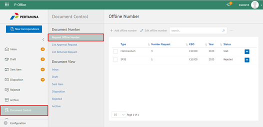

**Role yang sesuai**

- Sekretaris

Pengajuan nomor offline digunakan untuk *request* pemrosesan nomor dokumen secara offline. Sekretaris yang mengajukan nomor offline akan disetujui oleh admin approval nomor offline. Langkah - langkah untuk melakukan *request* nomor offline adalah sebagai berikut

1. Klik menu **Document Control** dan pilih tab **Request Offline Number**

2. Klik button "+ Add Offline Number" untuk melakukan *request* nomor offline

3. Sistem menampilkan form **Request Nomor Offline.** Isi form dan klik **Send**

4. Sistem berhasil menyimpan perubahan dan nomor offline yang sudah di *request* akan tampil di halaman daftar **Request Nomor Offline** dengan status **Waiting**

## **P-Office Versi Teams**

Langkah - langkah untuk request nomor offline via Teams adalah sebagai berikut:

1. Klik menu **Document Control** dan pilih tab **Request Offline Number**

2. Klik button "+ Add Offline Number" untuk melakukan *request* nomor offline

3. Sistem menampilkan form **Request Nomor Offline.** Isi form dan klik **Send**

4. Sistem berhasil menyimpan perubahan dan nomor offline yang sudah di *request* akan tampil di halaman daftar **Request Nomor Offline** dengan status **Waiting**

