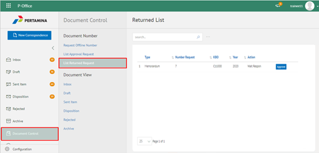
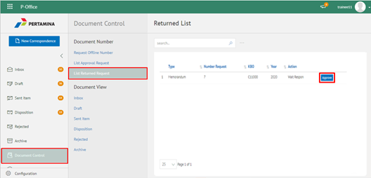
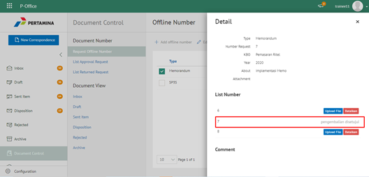
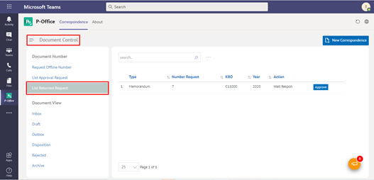
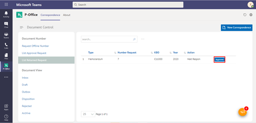
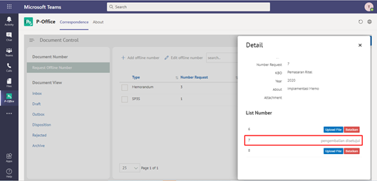

**Role yang sesuai**

- Admin Approver Offline Number

**Ditujukan untuk**

- Sekretaris

Admin Approver Offline Number dapat menyetujui pengembalian nomor offline yang dikembalikan oleh sekretaris. 

## **P-Office Versi Web**

Langkah - langkah untuk menyetujui pengembalian nomor offline via Web adalah sebagai berikut

1. Klik menu **Document Control** dan pilih tab **List Returned Request**

2. Pilih nomor offline yang akan disetujui dengan klik tombol **Approve**

3. Sistem menampilkan berhasil menyimpan perubahan. Nomor yang sudah disetujui akan berubah status menjadi **Approved**, sedangkan pada role sekretaris nomor offline yang disetujui pengembaliannya akan berubah status menjadi **Pengembalian Disetujui**

## **P-Office Versi Teams**

Langkah - langkah untuk setujui pengembalian nomor via Teams adalah sebagai berikut:

1. Klik menu **Document Control** dan pilih tab **List Returned Request**

2. Pilih nomor offline yang akan disetujui dengan klik tombol **Approve**

3. Sistem menampilkan berhasil menyimpan perubahan. Nomor yang sudah disetujui akan berubah status menjadi **Approved**, sedangkan pada role sekretaris nomor offline yang disetujui pengembaliannya akan berubah status menjadi **Pengembalian Disetujui**

