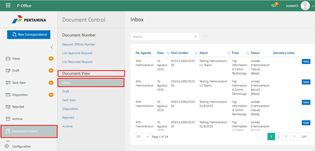
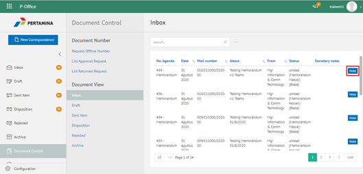
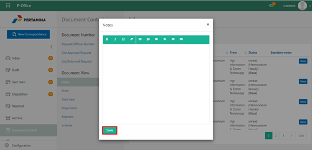

**Role yang sesuai**

- Sekretaris

Sekretaris dapat menambahkan *notes*/catatan terkait dokumen yang di-*review*. Langkah - langkah untuk menambah catatan dokumen adalah sebagai berikut

1. Klik menu **Document Control** dan pilih tab **Dokumen Masuk / Dokumen Keluar / Dokumen Disposisi**

2. Pilih dokumen/surat yang akan ditambahkan catatan dengan klik button **Notes**.

3. Sistem akan menapilkan _pop up_ **Tambah Catatan.** Isikan catatan dan klik tombol **Save**

4. Sistem berhasil menyimpan perubahan catatan dokumen