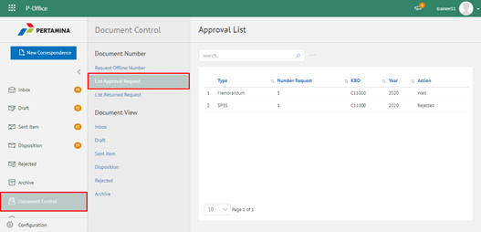
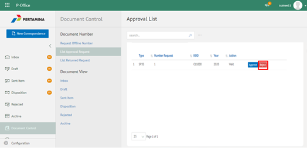
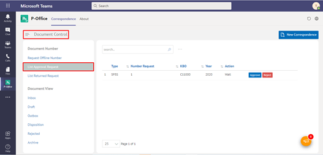
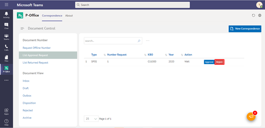

**Role yang sesuai**

- Admin Approver Offline Number

Admin Approver Offline Number dapat melakukan tindak lanjut terhadap pengajuan nomor offline dengan menolak / *reject* pengajuan  yang diajukan oleh sekretaris. 

## **P-Office Versi Web**

Langkah - langkah untuk menolak pengajuan nomor via Web adalah sebagai berikut :

1. Klik menu **Document Control** dan pilih tab **Approval List**

2. Pilih nomor offline yang akan ditolak kemudian pilih tombol **Reject**

3. Sistem berhasil menyimpan perubahan dan nomor offline yang ditolak akan tampil di menu "**Document Control - List Approval Request**" dengan status **Rejected** pada role admin P-Office. Sedangkan untuk role sekretaris tersimpan di menu "**Document Control - Request Offline Number**" dengan status **Rejected**

## **P-Office Versi Teams**

Langkah - langkah untuk tolak pengajuan nomor via Teams adalah sebagai berikut:

1. Klik menu **Document Control** dan pilih tab **Approval List**

2. Pilih nomor offline yang akan ditolak kemudian pilih tombol **Reject**

3. Sistem berhasil menyimpan perubahan dan nomor offline yang ditolak akan tampil di menu "**Document Control - List Approval Request**" dengan status **Rejected** pada role admin P-Office. Sedangkan untuk role sekretaris tersimpan di menu "**Document Control - Request Offline Number**" dengan status **Rejected**