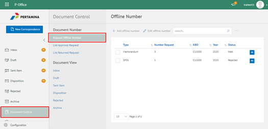
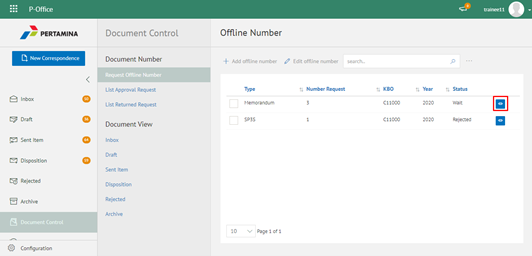
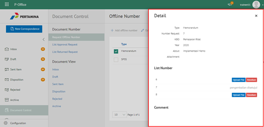
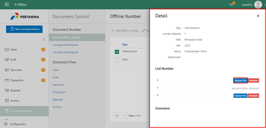
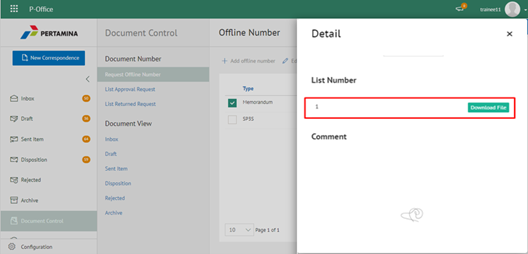
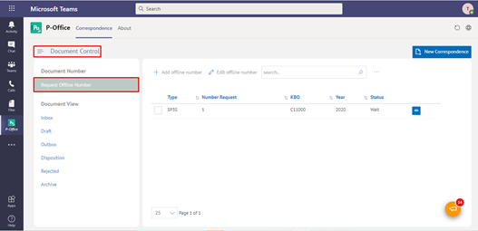
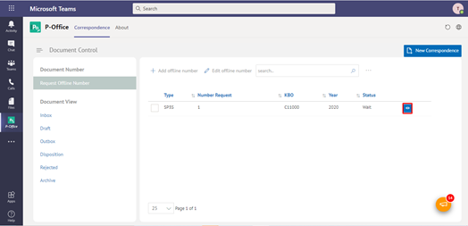
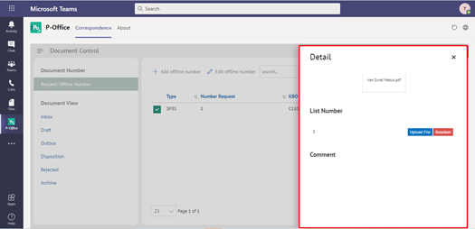
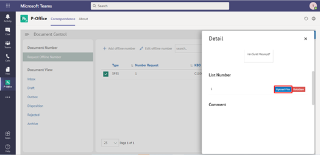
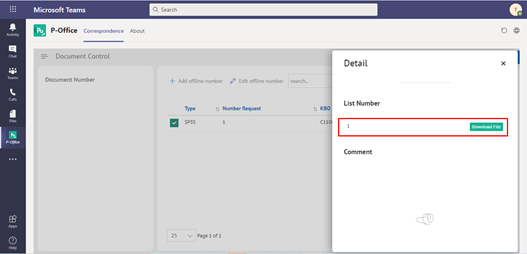

**Role yang sesuai**

- Sekretaris

Sekretaris dapat mengunggah dokumen permasing-masing nomor offline yang sudah di-*request*. Sekretaris yang sudah meunggah dokumen nomor offline dapat melakukan pengajuan nomor kembali maksimal 5 kali _request_. 

## **P-Office Versi Web**

Langkah-langkah untuk mengunggah dokumen nomor offline via Web adalah sebagai berikut

1. Klik menu **Document Control** dan pilih tab **Request Nomor Offline**

2. Pilih nomor offline yang akan diunggah dokumennya dengan klik tombol **Detail**

3. Sistem menampilkan detail nomor offline dan daftar nomor berapa saja yang di-*request*.

4. Pilih tombol **Upload File** dan pilih file yang akan diunggah

5. Sistem berhasil menunggah dokumen/file nomor offline. File yang sudah diunggah muncul di halaman detail nomor offline dan hasil unggahan dapat di unduh oleh *user*

## **P-Office Versi Teams**

Langkah - langkah untuk mengunggah dokumen offline number via Teams adalah sebagai berikut:

1. Klik menu **Document Control** dan pilih tab **Request Nomor Offline**

2. Pilih nomor offline yang akan diunggah dokumennya dengan klik tombol **Detail**

3. Sistem menampilkan detail nomor offline dan daftar nomor berapa saja yang di-*request*.

4. Pilih tombol **Upload File** dan pilih file yang akan diunggah

5. Sistem berhasil menunggah dokumen/file nomor offline. File yang sudah diunggah muncul di halaman detail nomor offline dan hasil unggahan dapat di unduh oleh *user*

