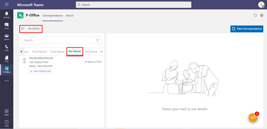

### **Melihat Dokumen Fax Masuk**
**Role yang sesuai**

- *Approver User*
- *Reviewer User*
- *Member User*

## **P-Office Versi Web**

Langkah - langkah untuk melihat daftar dokumem fax masuk via Web yaitu :

*User* dapat melihat dokumen fax masuk pada menu Archive. Langkah - langkah untuk melihat dokumen fax masuk adalah sebagai berikut:

1. Klik menu **Archive** dan pilih submenu **Fax Masuk**

 2. Sistem menampilkan dokumen fax masuk yang tersimpan di menu Archive

## **P-Office Versi Teams**

Langkah - langkah untuk melihat daftar dokumem fax masuk via Teams yaitu:

1.  Klik menu **Archive** dan pilih submenu **Fax Keluar**

2.  Sistem menampilkan dokumen fax keluar yang tersimpan di menu **Archive**

## **P-Office Versi Android**

Langkah - langkah untuk melihat daftar dokumem Fax Keluar via Android yaitu :

1. Klik menu **Archive** pilih submenu **Surat Masuk**
   
 

2. Sistem menampilkan dokumen surat masuk yang tersimpan di menu **Archive**