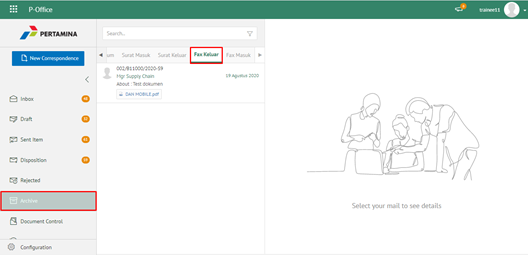

**Role yang sesuai**

- *Approver User*
- *Reviewer User*
- *Member User*

*User* dapat melihat dokumen fax keluar pada menu Archive. Langkah - langkah untuk melihat dokumen fax keluar adalah sebagai berikut:

1. Klik menu **Archive** dan pilih submenu **Fax Keluar**

2. Sistem menampilkan dokumen fax keluar yang tersimpan di menu Archive

## **P-Office Versi Teams**

Langkah - langkah untuk melihat daftar dokumem fax keluar via Teams yaitu :

1. _Klik menu **Archive** dan pilih submenu **Fax Masuk**

2.  Sistem menampilkan dokumen fax masuk yang tersimpan di menu **Archive**

## **P-Office Versi Android**

Langkah - langkah untuk melihat daftar dokumem Fax Masuk via Android yaitu :

1. Klik menu **Archive** pilih submenu **Fax Masuk**
   
 

1. Sistem menampilkan dokumen Fax Masuk yang tersimpan di menu **Archive**

