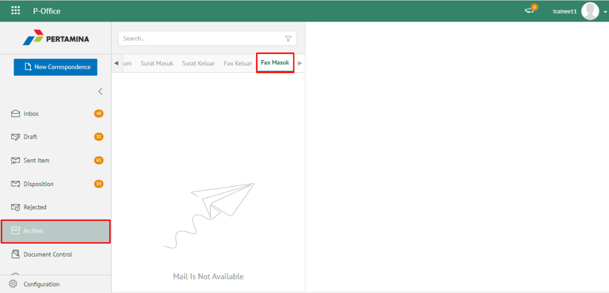
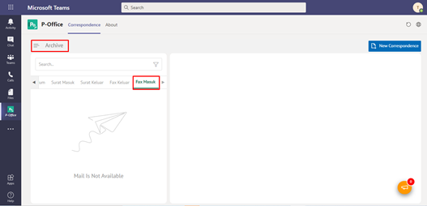
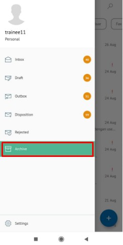
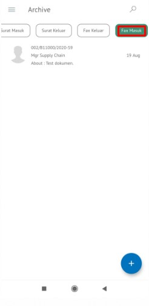
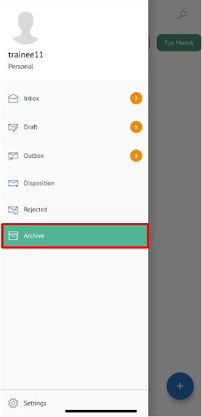
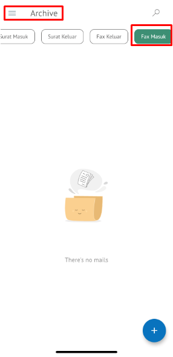

**Role yang sesuai**

- *Approver User*
- *Reviewer User*
- *Member User*
- Sekretaris

*User* dapat melihat dokumen fax masuk pada menu Archive.

## **P-Office Versi Web**

Langkah - langkah untuk melihat dokumen fax masuk via Web adalah sebagai berikut:

1. Klik menu **Archive** dan pilih submenu **Fax Masuk**

2. Sistem menampilkan dokumen fax keluar yang tersimpan di menu Archive

## **P-Office Versi Teams**

Langkah - langkah untuk melihat daftar dokumem fax keluar via Teams adalah sebagai berikut :

1. _Klik menu **Archive** dan pilih submenu **Fax Masuk**

2.  Sistem menampilkan dokumen fax masuk yang tersimpan di menu Archive

## **P-Office Versi Android**

Langkah - langkah untuk melihat daftar dokumem Fax Masuk via Android adalah sebagai berikut :

1. Klik menu **Archive** pilih submenu **Fax Masuk**
   
 

2. Sistem menampilkan dokumen Fax Masuk yang tersimpan di menu Archive

## **P-Office Versi IOS**

Langkah – langkah untuk melihat dokumen fax masuk via IOS adalah sebagai berikut:

1. Klik menu **Archive** dan pilih tab **Fax Masuk**

 

2. Sistem menampilkan dokumen fax masuk yang tersimpan di menu Archive
