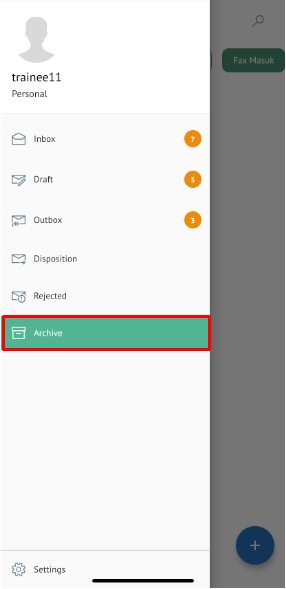

**Role yang sesuai**

- *Approver User*
- *Reviewer User*
- *Member User*
- Sekretaris

*User* dapat melihat dokumen memorandum pada menu Archive. 

## **P-Office Versi Web**

Langkah - langkah untuk melihat dokumen memorandum via Web adalah sebagai berikut

1. Klik menu **Archive** dan pilih submenu **Memorandum**

2. Sistem menampilkan dokumen memorandum yang tersimpan di menu Archive

## **P-Office Versi Teams**

Langkah - langkah untuk melihat daftar dokumem memorandum via Teams adalah sebagai berikut :

1. Klik menu **Archive** dan pilih submenu Memorandum

 2. Sistem menampilkan dokumen memorandum yang tersimpan di menu _Archive_

## **P-Office Versi Android**

Langkah - langkah untuk melihat daftar dokumem Memorandum via Android adalah sebagai berikut :

1. Klik menu **Archive** pilih submenu **Memorandum**
   
 

2. Sistem menampilkan dokumen memorandum yang tersimpan di menu Archive

## **P-Office Versi IOS**

Langkah – langkah untuk melihat dokumen memorandum adalah via IOS sebagai berikut :

1. Klik menu **Archive** dan pilih tab **Memorandum**

 

2. Sistem menampilkan dokumen memorandum yang tersimpan di menu Archive
