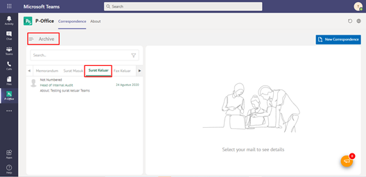

**Role yang sesuai**

- *Approver User*
- *Reviewer User*
- *Member User*

*User* dapat melihat dokumen surat keluar pada menu Archive. Langkah - langkah untuk melihat dokumen memorandum adalah sebagai berikut:

1. Klik menu **Archive** dan pilih submenu **Surat Keluar**

2. Sistem menampilkan dokumen surat keluar yang tersimpan di menu Archive

## **P-Office Versi Teams**

Langkah - langkah untuk melihat daftar dokumem surat keluar via Teams yaitu :

_User_ dapat melihat dokumen surat keluar pada menu _Archive_. Langkah – langkah untuk melihat dokumen memorandum adalah sebagai berikut :

1.  _Klik menu **Archive** dan pilih submenu Surat Keluar

2.  Sistem menampilkan dokumen surat keluar yang tersimpan di menu Archive