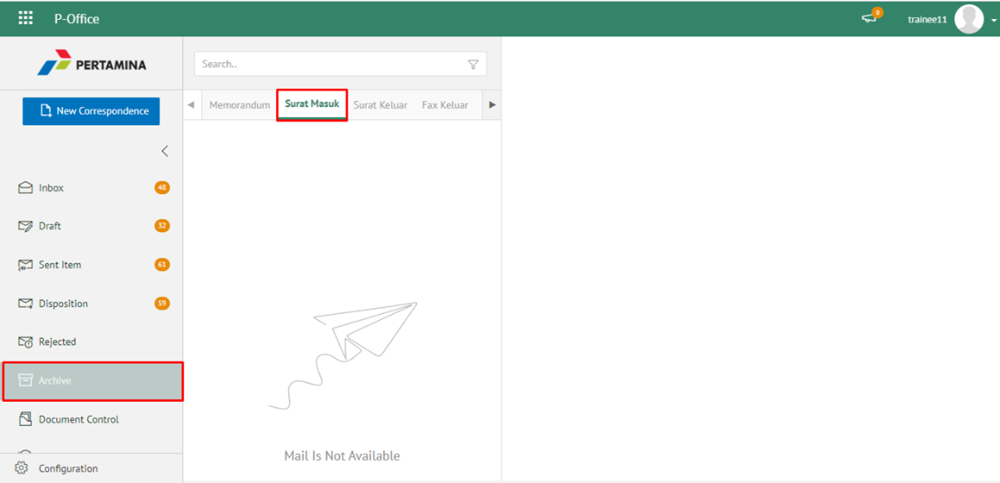
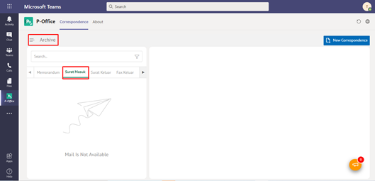
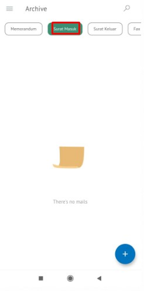
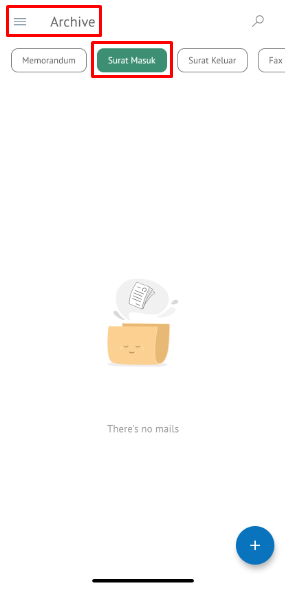

**Role yang sesuai**

- *Approver User*
- *Reviewer User*
- *Member User*
- Sekretaris

*User* dapat melihat dokumen surat masuk pada menu Archive. 

## **P-Office Versi Web**

Langkah - langkah untuk melihat dokumen surat masuk via Web adalah sebagai berikut :

1. lik menu **Archive** dan pilih submenu **Surat Masuk**

2. Sistem menampilkan dokumen surat masuk yang tersimpan di menu Archive

## **P-Office Versi Teams**

Langkah - langkah untuk melihat daftar dokumem Surat Masuk via Teams adalah sebagai berikut :

1. Klik menu **Archive** dan pilih submenu Surat Masuk

2.  Sistem menampilkan dokumen surat masuk yang tersimpan di menu _Archive_

## **P-Office Versi Android**

Langkah - langkah untuk melihat daftar dokumem Surat Masuk via Android adalah sebagai berikut :

1. Klik menu **Archive** pilih submenu **Surat Masuk**
   
 

2. Sistem menampilkan dokumen surat masuk yang tersimpan di menu Archive

## **P-Office Versi IOS**

1. Klik menu **Archive** dan pilih tab **Surat Masuk**

 
 
2. Sistem menampilkan dokumen surat masuk yang tersimpan di menu Archive