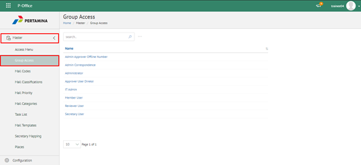
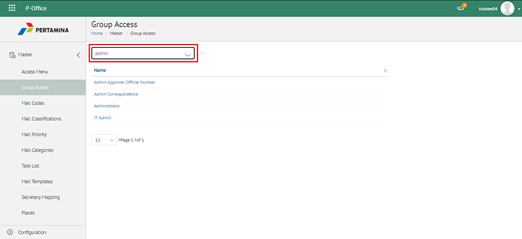
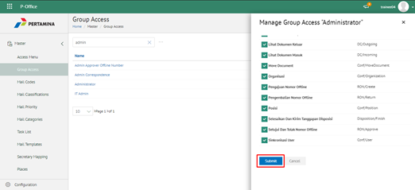

**Role yang sesuai**

- Admin eCorr

Admin eCorr dapat mengelola grup akses untuk pemberian kewenangan pada setiap role-nya. Akses menu ditambahkan kemudian admin eCorr akan melakukan _grouping_ untuk setiap grup akses. Pengelolaan grup akses yang dilakukan admin eCorr antara lain yaitu

- Mencari grup akses
- Menambah grup akses untuk setiap role

Langkah - langkah untuk pengelolaan grup akses adalah sebagai berikut:

#### **Mencari Menu Akses**

1.    Pilih menu **Master** dan pilih submenu **Group Access**

2.    Pilih tombol **Search** dan masukkan pencarian berdasarkan kata kunci, kemudian klik **Enter**

#### **Menambah Grup Akses untuk Setiap Role**

1.    Pilih menu **Master** dan pilih submenu **Access Menus**

2.    Pilih role yang akan ditambahkan grup akses kemudian checklist grup menu yang akan diberikan akses dan klik **Submit**

