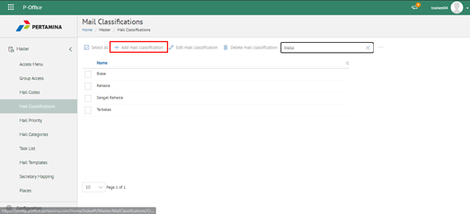
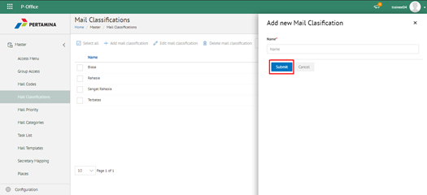
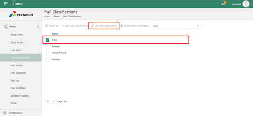
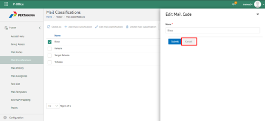
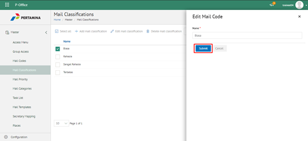
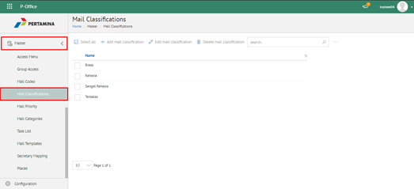
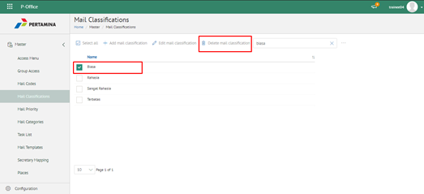
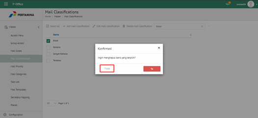
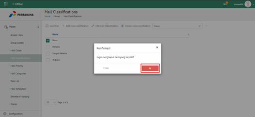

**Role yang sesuai**

- Admin eCorr

Admin eCorr dapat mengelola klasifikasi surat yang digunakan dalam penginputan form surat. Pengelolaan klasifikasi surat yang dilakukan admin eCorr antara lain yaitu

- Mencari klasifikasi surat
- Menambah klasifikasi surat
- Mengubah klasifikasi surat
- Menghapus klasifikasi surat

Langkah - langkah untuk pengelolaan klasifikasi surat adalah sebagai berikut:

#### **Mencari Klasifikasi surat**

1.    Pilih menu **Master** dan pilih submenu **Mail Classification**

2.    Pilih tombol **Search** dan masukkan pencarian berdasarkan kata kunci, kemudian klik **Enter**

#### **Menambah Klasifikasi Surat**

1.    Pilih menu **Master** dan pilih submenu **Mail Classification**

2.    Pilih tombol **+ Add Mail Classification** untuk menambah klasifikasi surat

3.    Isikan informasi klasifikasi surat meliputi nama kemudian klik tombol **Submit.**

4.    Sistem menyimpan perubahan dan data akan muncul di halaman daftar klasifikasi surat

#### **Mengubah Klasifikasi Surat**

1.    Pilih menu **Master** dan pilih submenu **Mail Classification**

2.    Klik checklist pada klasifikasi surat yang akan diubah kemudian klik tombol **Edit Mail Classification**

3.    Lakukan perubahan pada klasifikasi surat, pilih **Cancel** untuk membatalkan proses

4.    Lakukan perubahan pada klasifikasi surat kemudian klik tombol **Submit**

5.    Sistem menyimpan perubahan dan data akan muncul di halaman daftar klasifikasi surat
 

#### **Menghapus Klasifikasi Surat**

1.    Pilih menu **Master** dan pilih submenu **Mail Classification**

2.    Klik checklist pada klasifikasi surat yang akan dihapus kemudian klik icon **Delete Mail Classification**

3.    Klik tombol **Cancel** untuk membatalkan proses

4.    Klik tombol **Ya** untuk menghapus klasifikasi surat. Sistem menyimpan perubahan dan data akan terhapus dari daftar klasifikasi surat

