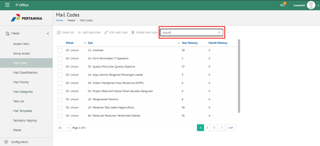
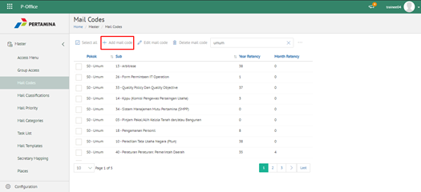
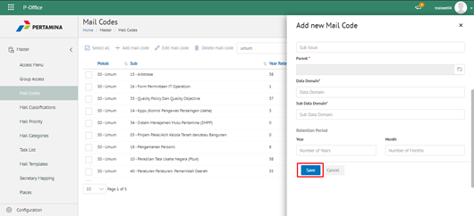
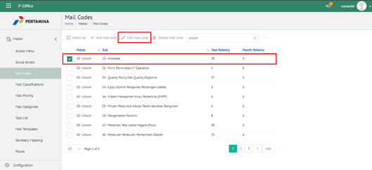
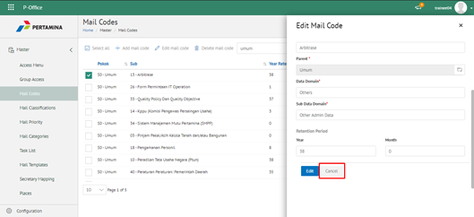
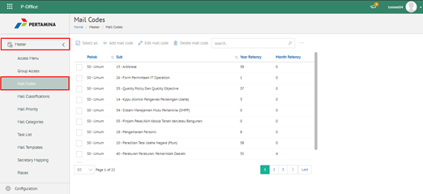
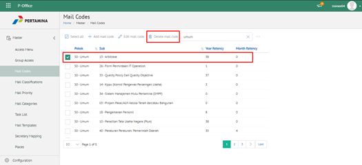
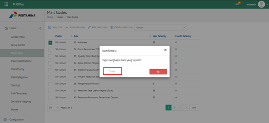
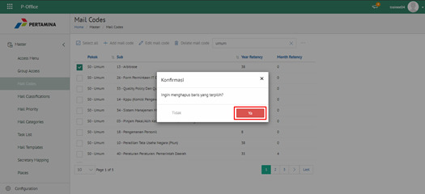

**Role yang sesuai**

- Admin P-Office

Admin P-Office dapat mengelola kode simpan yang digunakan dalam penginputan form surat. Pengelolaan kode simpan yang dilakukan admin P-Office antara lain yaitu

- Mencari kode simpan
- Menambah kode simpan
- Mengubah kode simpan
- Menghapus kode simpan

## **P-Office Versi Web**

Langkah - langkah untuk pengelolaan kode simpan via Web adalah sebagai berikut

#### **Mencari Kode Simpan**

1.    Pilih menu **Master** dan pilih submenu **Mail Code**

2.    Pilih tombol **Search** dan masukkan pencarian berdasarkan kata kunci, kemudian klik **Enter**

#### **Menambah Kode Simpan**

1.    Pilih menu **Master** dan pilih submenu **Mail Code**

2.    Pilih tombol **+ Add Mail Code** untuk menambah kode simpan

3.    Isikan informasi kode simpan meliputi nama dan kode kemudian klik tombol **Submit.**

4.    Sistem menyimpan perubahan dan data akan muncul di halaman daftar kode simpan

#### **Mengubah Kode Simpan**

1.    Pilih menu **Master** dan pilih submenu **Mail Code**

2.	  Klik checklist pada kode simpan yang akan diubah kemudian klik **Edit Mail Code**

3.    Lakukan perubahan pada kode simpan, pilih **Cancel** untuk membatalkan proses

4.    Lakukan perubahan pada kode simpan kemudian klik tombol **Submit** untuk menyimpan perubahan

5.	  Sistem menyimpan perubahan dan data akan muncul di halaman daftar kode simpan

####  **Menghapus Kode Simpan**

1.    Pilih menu **Master** dan pilih submenu **Mail Code**

2.    Klik checklist pada kode simpan yang akan dihapus kemudian klik tombol **Delete Mail Code**

3.	  Klik tombol **Tidak** untuk membatalkan proses

4.    Klik tombol **Ya** untuk menghapus kode simpan. Sistem menyimpan perubahan dan data akan terhapus dari daftar kode simpan

