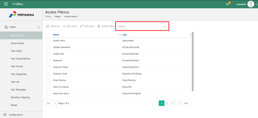
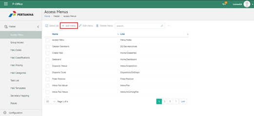
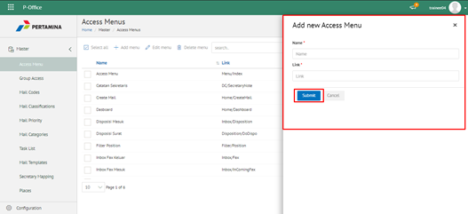
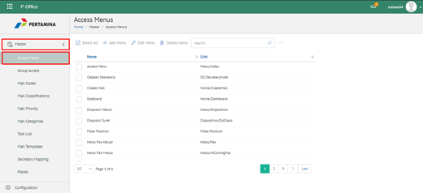
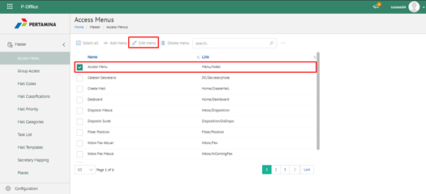
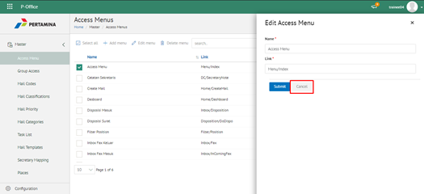
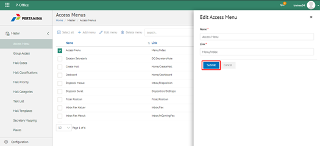
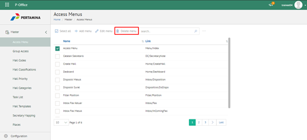
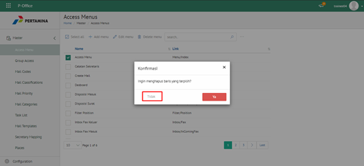
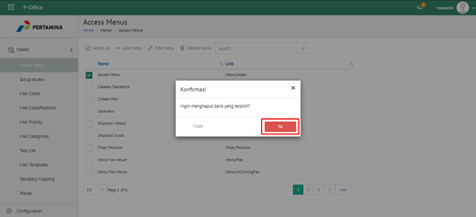

**Role yang sesuai**

- Admin eCorr

Admin eCorr dapat mengelola akses menu yang digunakan dalam dalam pemberian hak akses pada setiap role-nya. Pengelolaan akses menu yang dilakukan admin eCorr antara lain yaitu

- Mencari akses menu
- Menambah akses menu
- Mengubah akses menu
- Menghapus akses menu

Langkah - langkah untuk pengelolaan akses menu adalah sebagai berikut:

#### **Mencari Menu Akses**

1.    Pilih menu **Master** dan pilih submenu **Access Menus**

2.    Pilih tombol **Search** dan masukkan pencarian berdasarkan kata kunci, kemudian klik **Enter**

#### **Menambah Menu Akses**

1.    Pilih menu **Master** dan pilih submenu **Access Menus**

2.    Pilih tombol **+ Add Menu** untuk menambah menu akses

3.    Isikan informasi menu akses meliputi nama dan link akses menu kemudian klik tombol **Submit.**

4.    Sistem menyimpan perubahan dan data akan muncul di halaman daftar menu akses

#### **Mengubah Menu Akses**

1.    Pilih menu **Master** dan pilih submenu **Access Menus**

2.    Klik checklist pada akses menu yang akan diubah kemudian klik tombol **Edit Menu**

3.    Lakukan perubahan pada kategori surat, pilih **Cancel** untuk membatalkan proses

4.    Lakukan perubahan pada kategori surat kemudian klik tombol **Submit**

5.    Sistem menyimpan perubahan dan data akan muncul di halaman daftar kategori surat

#### **Menghapus Menu Akses**

1.    Pilih menu **Master** dan pilih submenu **Access Menus**

2.    Klik checklist pada kategori surat yang akan dihapus kemudian klik tombol **Delete**

3.    Klik tombol **Cancel** untuk membatalkan proses

4.	  Klik tombol **Ya** untuk menghapus menu akses. Sistem menyimpan perubahan dan data akan terhapus

