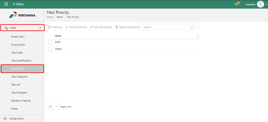
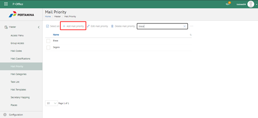
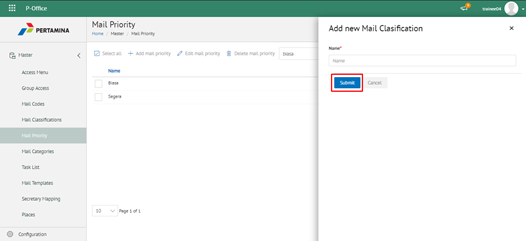
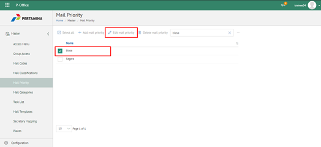
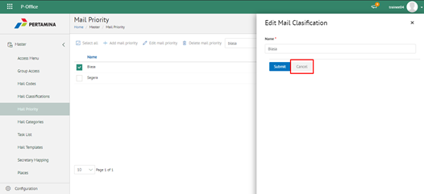
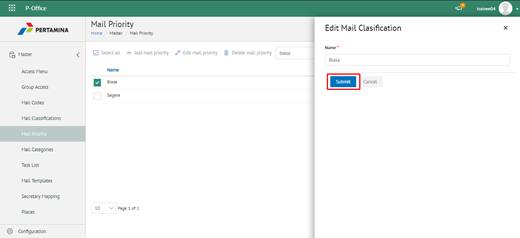
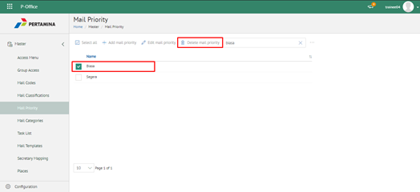
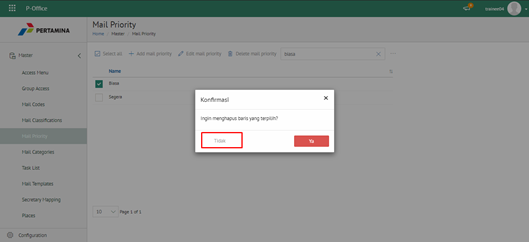
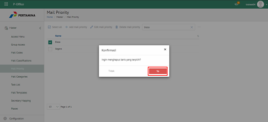

**Role yang sesuai**

- Admin eCorr

Admin eCorr dapat mengelola prioritas surat yang digunakan dalam penginputan form surat. Pengelolaan prioritas surat yang dilakukan admin eCorr antara lain yaitu

- Mencari prioritas surat
- Menambah prioritas surat
- Mengubah prioritas surat
- Menghapus prioritas surat

Langkah - langkah untuk pengelolaan prioritas surat adalah sebagai berikut:

#### **Mencari Prioritas Surat**

1.    Pilih menu **Master** dan pilih submenu **Mail Priority**

2.    Pilih tombol **Search** dan masukkan pencarian berdasarkan kata kunci, kemudian klik **Enter**

#### **Menambah Prioritas Surat**

1.    Pilih menu **Master** dan pilih submenu **Mail Priority**

2.    Pilih tombol **+ Add Mail Priority** untuk menambah prioritas surat

3.    Isikan informasi prioritas surat meliputi nama kemudian klik tombol **Submit.**

4.    Sistem menyimpan perubahan dan data akan muncul di halaman daftar prioritas surat

#### **Mengubah Prioritas Surat**

1.    Pilih menu **Master** dan pilih submenu **Mail Priority**

2.    Klik checklist pada prioritas surat yang akan diubah kemudian klik icon **Edit Mail Priority**

3.    Lakukan perubahan pada prioritas surat, pilih **Cancel** untuk membatalkan proses

4.    Lakukan perubahan pada prioritas surat kemudian klik tombol **Submit**

5.    Sistem menyimpan perubahan dan data akan muncul di halaman daftar prioritas surat

#### **Menghapus Prioritas Surat**

1.    Pilih menu **Master** dan pilih submenu **Mail Priority**

2.    Klik checklist pada prioritas surat yang akan dihapus kemudian klik tombol **Delete**

3.    Klik tombol **Cancel** untuk membatalkan proses

4.    Klik tombol **Ya** untuk menghapus prioritas surat. Sistem menyimpan perubahan dan data akan terhapus dari daftar prioritas surat

