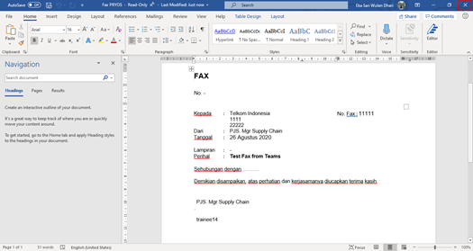

**Role yang sesuai**

- *Approver User*
- *Reviewer User*
- *Member User* (Pekerja)

*User* dapat melakukan *drafting* fax keluar pada aplikasi P-Office. *Drafting* fax keluar dilakukan jika *user* akan meneruskan dan melakukan perubahan pada fax keluar yang sudah disimpan pada menu **Draft**. Langkah - langkah untuk melakukan *drafting* fax keluar adalah sebagai berikut

1. Klik menu **Draft** dan pilih tab **Fax Keluar**

2. Pilih fax keluar yang akan diubah. Pilih tab **Detail** kemudian klik **Edit**

3. Sistem akan menampilkan *form* **Edit Correspondence**

4. Lakukan perubahan pada *form*. Klik **Simpan** untuk menyimpan perubahan pada *form* fax keluar. Surat yang disimpan akan tersimpan di menu **"Draft - Fax Keluar"**

5. Klik **Ubah Isi** untuk mengubah isi fax keluar

6. Sistem menampilkan tampilan *preview* fax keluar dalam bentuk Word yang dapat di edit. Untuk melakukan *editing* terhadap isi surat klik **Edit Content** kemudian sistem akan menampilkan *pop up* konfirmasi **Ubah Word Desktop** atau **Ubah Online**

#### **[Edit] Word Desktop**

Langkah - langkah untuk mengubah isi fax keluar melalui Word Desktop adalah sebagai berikut

1. Klik **Ubah di Word** untuk mengubah melalui aplikasi Microsoft Word

2. Lakukan perubahan pada isi surat. Klik Close pada aplikasi dan isi surat akan otomatis tersimpan

#### **[Edit] Ubah Online**

Langkah - langkah untuk mengubah isi fax keluar secara *online* adalah sebagai berikut

1. Klik **Ubah Online** untuk mengubah isi surat secara *online*

2. Lakukan perubahan pada isi surat. Klik **Close** pada aplikasi

3. Isi surat akan otomatis tersimpan. Jika surat akan disimpan sebagai draft, maka klik **Close**.

4. Surat yang sudah selesai diubah maka akan tersimpan di menu **"Draft - Fax keluar"**

#### **Kirim Fax Keluar**

Langkah - langkah untuk mengirim fax keluar adalah sebagai berikut

1. Pada tampilan *preview* fax keluar, klik **Kirim** untuk mengirim surat ke pejabat tujuan

2. Sistem menyimpan perubahan dan fax keluar akan tersimpan di menu **"Outbox - Fax keluar"**

## **P-Office Versi Teams**

Langkah - langkah untuk drafting fax keluar via Teams adalah sebagai berikut:

1. Klik menu **Draft** dan pilih tab **Fax Keluar**

2. Pilih fax keluar yang akan diubah. Pilih tab **Detail** kemudian klik **Edit**

3. Sistem akan menampilkan *form* **Edit Correspondence**

4. Lakukan perubahan pada *form*. Klik **Save** untuk menyimpan perubahan pada *form* fax keluar. Surat yang disimpan akan tersimpan di menu **"Draft - Fax Keluar"**

5. Klik **Edit Content** untuk mengubah isi fax keluar

6. Sistem menampilkan tampilan *preview* fax keluar dalam bentuk Word yang dapat di edit. Untuk melakukan *editing* terhadap isi surat klik **Ubah Isi** kemudian sistem akan menampilkan *pop up* konfirmasi **Ubah Word Desktop** atau **Ubah Online**

#### **[Edit] Word Desktop**

Langkah - langkah untuk mengubah isi fax keluar melalui Word Desktop adalah sebagai berikut

1. Klik **Open in Destop App** untuk mengubah melalui aplikasi Microsoft Word

2. Lakukan perubahan pada isi surat. Klik Close pada aplikasi dan isi surat akan otomatis tersimpan

#### **[Edit] Ubah Online**

Langkah - langkah untuk mengubah isi fax keluar secara *online* adalah sebagai berikut

1.	Ketika Klik *button* **Edit Content** maka secara otomatis akan membuka dokumen dan bisa mengubah isi surat secara *online*

2. Lakukan perubahan pada isi surat. Klik **Close** pada aplikasi

3. Isi surat akan otomatis tersimpan. Jika surat akan disimpan sebagai draft, maka klik **Close**.

4. Surat yang sudah selesai diubah maka akan tersimpan di menu **"Draft - Fax keluar"**

#### **Kirim Fax Keluar**

Langkah - langkah untuk mengirim fax keluar adalah sebagai berikut

1. Pada tampilan *preview* fax keluar, klik **Kirim** untuk mengirim surat ke pejabat tujuan

2. Sistem menyimpan perubahan dan fax keluar akan tersimpan di menu **"Outbox - Fax keluar"**

## **P-Office Versi Teams**

Langkah - langkah untuk Draftinng fax keluar adalah sebagai berikut

1. Klik menu **Draft** dan pilih tab **Fax Keluar**

 

2. Pilih fax keluar yang akan diubah. Pilih tab **Detail** kemudian klik **tombol button**
   
 

3. Sistem akan menampilkan _form_ **Edit**
 

4. Lakukan perubahan pada _form_. Klik **Save Mail** untuk menyimpan perubahan pada _form_ fax keluar. Surat yang disimpan akan tersimpan di menu “**Draft – Fax Keluar”**

  

5. Klik **Edit Content** untuk mengubah isi fax keluar

6. Sistem menampilkan tampilan _preview_ fax keluar dalam bentuk Word yang dapat di edit. Untuk melakukan _editing_ terhadap isi surat klik **Ubah Isi** kemudian sistem akan menampilkan _pop up_ konfirmasi **Ubah Word Online**
   
**[Edit] Ubah Online**

Langkah – langkah untuk mengubah isi fax keluar secara _online_ adalah sebagai berikut.

1. Klik **Edit Content** untuk mengubah isi surat secara _online_

2. Lakukan perubahan pada isi surat lalu sistem akan menampilkan pop up P-Office Editing Document pilih **Yes**

  

3. Isi surat akan otomatis tersimpan. Jika surat akan disimpan sebagai draft, maka klik **Close.**

 

4. Surat yang sudah selesai diubah maka akan tersimpan di menu “**Draft – Fax keluar”**
   
**Kirim Fax Keluar**

Langkah – langkah untuk mengirim fax keluar adalah sebagai berikut.

1. Pada tampilan _preview_ fax keluar, klik **Kirim** untuk mengirim surat ke pejabat tujuan

2. Sistem menyimpan perubahan dan fax keluar akan tersimpan di menu “**Outbox - Fax keluar**”