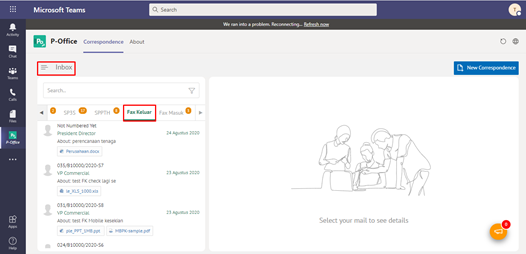
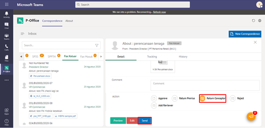

**Role yang sesuai**

- *Approver User*
- *Reviewer User*

*User* dapat mengembalikan fax keluar ke konseptor jika hasil review belum / tidak sesuai. Langkah-langkah untuk mengembalikan fax keluar ke konseptor adalah sebagai berikut

1. Klik menu **Inbox** dan pilih tab **Fax Keluar**

2. Pilih fax keluar yang akan ditindak lanjuti kemudian pilih tab **Detail**

3. Klik tombol **Kembalikan ke Konseptor** dan pilih **Send**. Isikan komentar jika diperlukan

4. Sistem berhasil menyimpan perubahan. Fax keluar yang sudah di kirim akan tersimpan di menu **Outbox- Fax Keluar** dan konseptor akan menerima fax keluar di menu **Draft - Fax Keluar**

## **P-Office Versi Teams**

Langkah - langkah untuk kembalikan kekonseptor via Teams adalah sebagai berikut:

1. Klik menu **Inbox** dan pilih tab **Fax Keluar**

2. Pilih fax keluar yang akan ditindak lanjuti kemudian pilih tab **Detail**

3. Klik tombol **Return Conceptor** dan pilih **Send**. Isikan komentar jika diperlukan

4. Sistem berhasil menyimpan perubahan. Fax keluar yang sudah di kirim akan tersimpan di menu **Outbox- Fax Keluar** dan konseptor akan menerima fax keluar di menu **Draft - Fax Keluar**