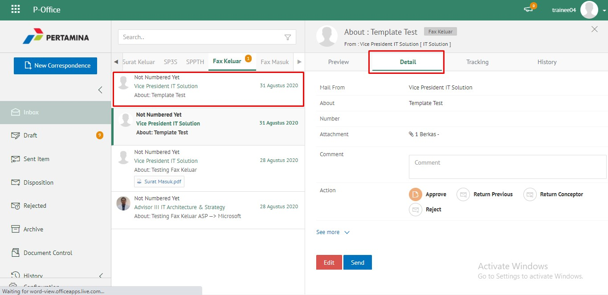
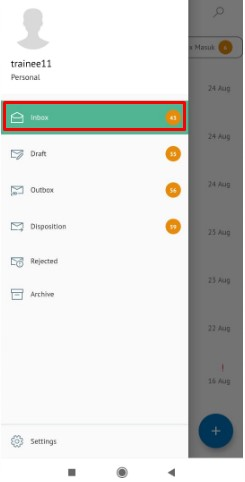
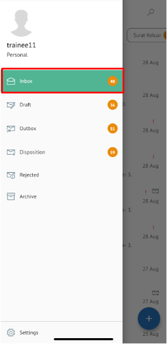
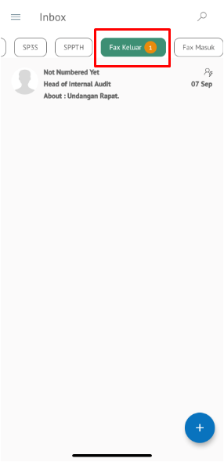

**Role yang sesuai**

- *Approver User*
- *Reviewer User*

*User* dapat mengembalikan fax keluar ke sebelumnya jika hasil review belum / tidak sesuai. Surat akan dikembalikan ke satu level *reviewer* sebelumnya atau ke konseptor (apabila hanya ada satu *reviewer*). Langkah - langkah untuk mengembalikan fax keluar ke sebelumnya adalah sebagai berikut

1. Klik menu **Inbox** dan pilih tab **Fax Keluar**

2. Pilih fax keluar yang akan ditindak lanjuti kemudian pilih tab **Detail**

3. Klik tombol **Return Previous** dan pilih **Send**. Isikan komentar jika diperlukan

4. Sistem berhasil menyimpan perubahan. Fax keluar yang sudah di kirim akan tersimpan di menu **Outbox - Fax Keluar** dan penerima pengembalian fax keluar akan menerima fax keluar di menu **Draft - Fax Keluar**

## **P-Office Versi Teams**

Langkah - langkah untuk kembalikan kesebelumnya via Teams adalah sebagai berikut:

1. Klik menu **Inbox** dan pilih tab **Fax Keluar**

2. Pilih fax keluar yang akan ditindak lanjuti kemudian pilih tab **Detail**

3. Klik tombol **Return Previous** dan pilih **Send**. Isikan komentar jika diperlukan

4. Sistem berhasil menyimpan perubahan. Fax keluar yang sudah di kirim akan tersimpan di menu **Outbox - Fax Keluar** dan penerima pengembalian fax keluar akan menerima fax keluar di menu **Draft - Fax Keluar**

## **P-Office Versi Teams**

Langkah - langkah untuk kembalikan kesebelumnya via Android adalah sebagai berikut:

1. Klik menu **Inbox** dan pilih tab **Fax Keluar**

 

2. Pilih fax keluar yang akan ditindak lanjuti kemudian pilih icon **Option**

 

3. Klik tombol **Revise to Previous** kemudian sistem menampilkan pop up dan user mengisi komentar lalu klik **Send**

 

4. Sistem berhasil menyimpan perubahan. Fax keluar yang sudah di kirim akan tersimpan di menu **Outbox - Fax Keluar** dan penerima pengembalian fax keluar akan menerima fax keluar di menu **Draft - Fax Keluar**

## **P-Office Versi IOS**

Langkah - langkah untuk kembalikan kesebelumnya via IOS adalah sebagai berikut:

1. Klik menu **Inbox** dan pilih tab **Fax Keluar**

 

2. Pilih fax keluar yang akan ditindak lanjuti kemudian pilih icon **Option** dan piluh **Revise to Previous**

 

3.  Isikan komentar jika diperlukan kemudian klik **Send** untuk menyimpan perubahan. Fax keluar yang sudah di kirim akan tersimpan di menu **Outbox - Fax Keluar**

