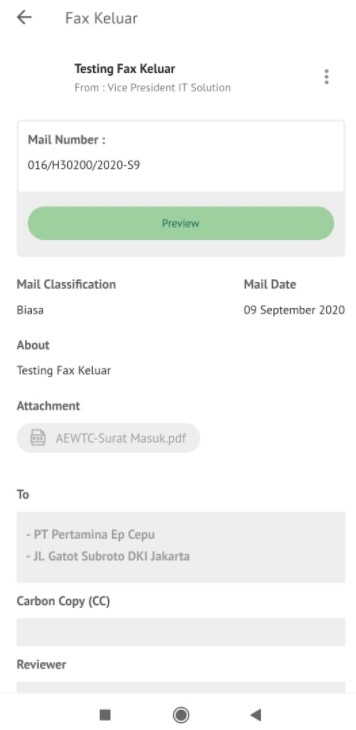

**Role yang sesuai**

- *Approver User*

*Approver User* dapat mengesahkan fax keluar yang sudah dikirim dan direview oleh reviewer. Keluaran untuk tindak lanjut ini adalah untuk men-*generate* nomor fax keluar kemudian fax keluar dapat dikirimkan ke pejabat tujuan. Langkah - langkah untuk menambah reviewer fax keluar adalah sebagai berikut

1. Klik menu **Inbox** dan pilih tab **Fax Keluar**

2. Pilih fax keluar yang akan ditindak lanjuti kemudian pilih tab **Detail.** Pada tab **Detail** terdapat informasi nomor surat yang masih bersifat sementara. Nomor inilah yang akan ter-*generate* jika *user* menyetujui fax keluar.

3. Klik **Approve** kemudian pilih **Send**

4. Sistem menampilkan *form* Validation of Digital Signature kemudian isikan alamat email untuk mengirim kode OTP validasi digital signature kemudian klik **Send OTP**

5. Buka email dan salin kode OTP pada form P-Office kemudian klik **Sign**

6. Surat keluar yang sudah disetujui akan tersimpan di menu **"Outbox - Surat Keluar"** pengirim sedangkan surat keluar akan tersimpan di menu **"Inbox - Surat Keluar"** penerima

## **P-Office Versi Teams**

Langkah - langkah untuk mengesahkan fax keluar via Teams adalah sebagai berikut:

1. Klik menu **Inbox** dan pilih tab **Fax Keluar**

2. Pilih fax keluar yang akan ditindak lanjuti kemudian pilih tab **Detail.** Pada tab **Detail** terdapat informasi nomor surat yang masih bersifat sementara. Nomor inilah yang akan ter-*generate* jika *user* menyetujui fax keluar.

3. Klik **Setujui** kemudian pilih **Send**

4.	Sistem menampilkan form Validation of Digital Signature

 
5.	Kemudian isikan NIK dan PassPhrase pada form P-Office kemudian klik **Sign**

6.	Surat keluar yang sudah disetujui akan tersimpan di menu **“Outbox – Fax keluar”** pengiriman sedangkan surat keluar akan tersimpan di menu **“Inbox – Fax keluar”** penerima

## **P-Office Versi Android**

Langkah - langkah untuk mengesahkan fax keluar via Android adalah sebagai berikut:

1. Klik menu **Inbox** dan pilih tab **Fax Keluar**

  

2. Pilih fax keluar yang akan ditindak lanjuti kemudian pada **Detail** terdapat informasi nomor surat yang masih bersifat sementara. Nomor inilah yang akan ter-_generate_ jika _user_ menyetujui fax keluar. Pilih icon **Option** dan pilih **Approve**

   

3. Sistem menyimpan perubahan dan nomor fax keluar akan ter-_generate_ sesuai dengan nomor sementara pada detail. Fax keluar yang sudah disetujui akan tersimpan di menu “**Outbox - Fax Keluar**” pengirim sedangkan fax keluar akan tersimpan di menu “**Inbox - Fax Keluar**” penerima.

## **P-Office Versi IOS**

Langkah - langkah untuk mengesahkan fax keluar via IOS adalah sebagai berikut:

1. Klik menu **Inbox** dan pilih tab **Fax Keluar**

 

2. Pilih fax keluar yang akan ditindak lanjuti kemudian pada **Detail** terdapat informasi nomor surat yang masih bersifat sementara. Nomor inilah yang akan ter-_generate_ jika _user_ menyetujui fax keluar. Pilih icon **Option** dan pilih **Approve**

 

3. Sistem menampilkan *form* Approve Mail & Signing Documents. Isikan komentar, NIK dan Pass Phrase kemudian klik **Send**

4. Nomor surat keluar akan ter-_generate_ sesuai dengan nomor sementara pada detail. Surat keluar yang sudah disetujui akan tersimpan di menu “**Outbox - Surat Keluar**” pengirim sedangkan surat keluar akan tersimpan di menu “**Inbox - Surat Keluar**” penerima.

