**Ditujukan kepada**

- *Approver User*
- *Reviewer User*

**Role yang sesuai**

- *Member User* (Pekerja)

*Member User* dapat menyimpan fax keluar sebagai *template*. *Template* ini digunakan jika sewaktu-waktu *user* akan melanjutkan fax keluar yang sudah dibuat dan diubah kembali kemudian dikirimkan kepejabat tujuan tanpa harus mengisi *form* fax keluar.

## **P-Office Versi Web**

Langkah - langkah untuk Save as Template via Web adalah sebagai berikut :

1. Isi *form* fax keluar dan Klik **Save as Template**

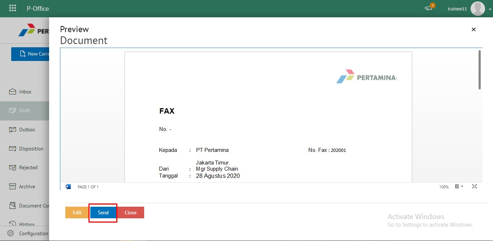

2. Fax keluar yang disimpan menjadi *template* akan tersimpan di menu **"Draft - Fax Keluar"**. Untuk melanjutkan *template* yang sudah dibuat *user* dapat memilih menu **"Draft - Keluar"** kemudian pilih *template* yang akan digunakan

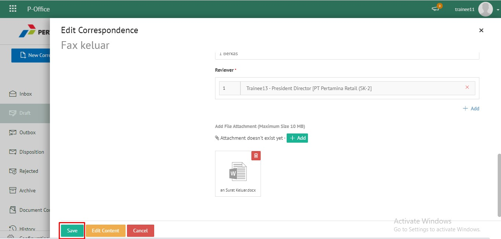

3. Pilih tombol ***User*** **Template** untuk melanjutkan edit fax keluar

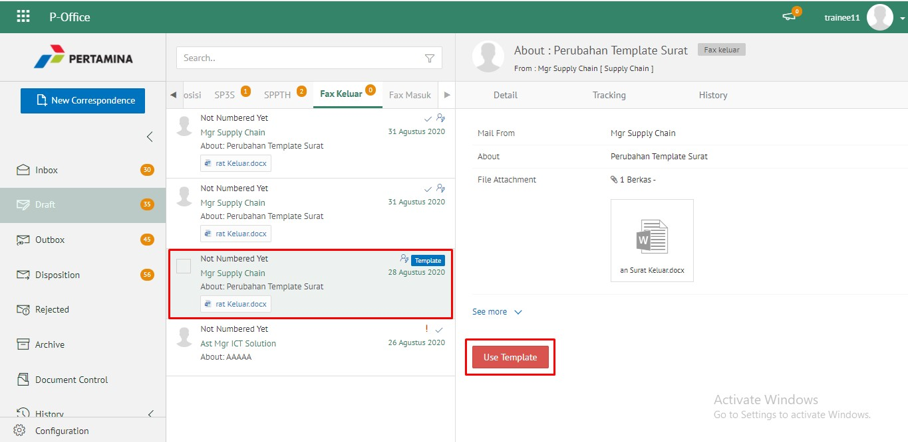

4. Sistem akan menampilkan form **Edit Correspondence,** klik **Save** untuk menyimpan perubahan

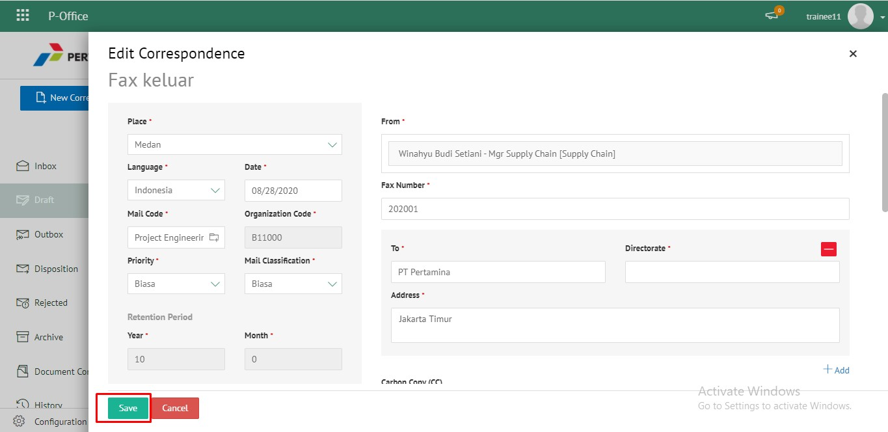

5. Lakukan perubahan pada fax, klik **Save** untuk menyimpan perubahan dan fax keluar akan tersimpan di menu **"Draft - Fax Keluar"** sebagai draft atau klik **Send** untuk mengirimkan ke pejabat tujuan dan tersimpan di menu **"Outbox - Fax Keluar"**.

## **P-Office Versi Teams**

Langkah - langkah untuk save as template fax keluar via Teams adalah sebagai berikut:

1. Isi *form* fax keluar dan Klik **Save Template**

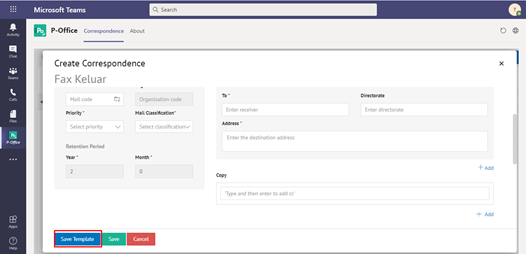

2. Fax keluar yang disimpan menjadi *template* akan tersimpan di menu **"Draft - Fax Keluar"**. Untuk melanjutkan *template* yang sudah dibuat *user* dapat memilih menu **"Draft - Keluar"** kemudian pilih *template* yang akan digunakan

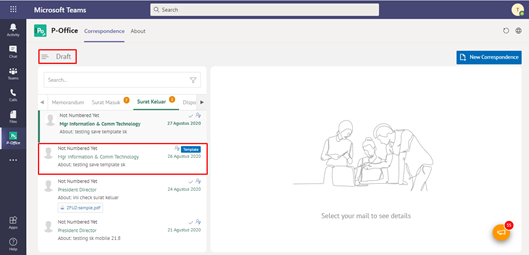

3. Pilih tombol ***User*** **Template** untuk melanjutkan edit fax keluar

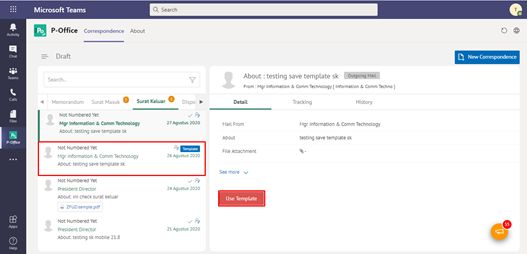

4. Sistem akan menampilkan form **Edit Correspondence,** klik **Save** untuk menyimpan perubahan

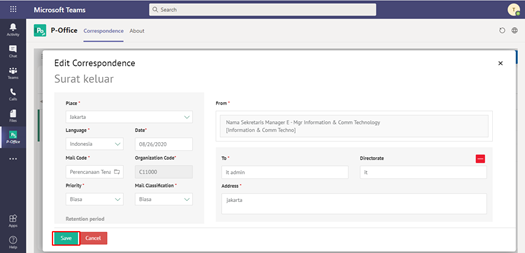

5. Lakukan perubahan pada fax, klik **Simpan** untuk menyimpan perubahan dan fax keluar akan tersimpan di menu **"Draft - Fax Keluar"** sebagai draft atau klik **Send** untuk mengirimkan ke pejabat tujuan dan tersimpan di menu **"Outbox - Fax Keluar"**.

## **P-Office Versi Android**

Langkah - langkah untuk save as template fax keluar via Android adalah sebagai berikut:

1. Isi _form_ fax keluar dan Klik **Save as Template**

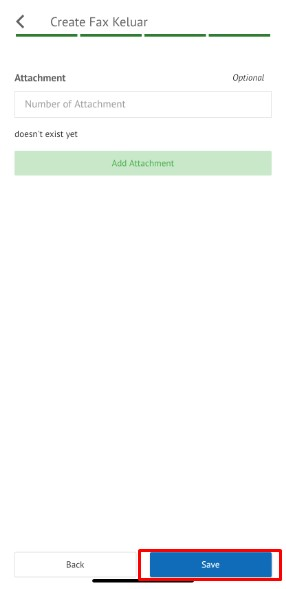 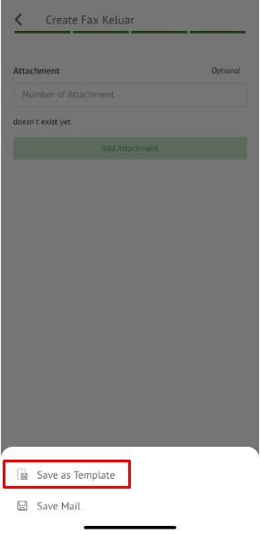

2. Fax keluar yang disimpan menjadi _template_ akan tersimpan di menu “**Draft – Fax Keluar”.** Untuk melanjutkan _template_ yang sudah dibuat _user_ dapat memilih menu “**Draft – Keluar**” kemudian pilih _template_ yang akan digunakan

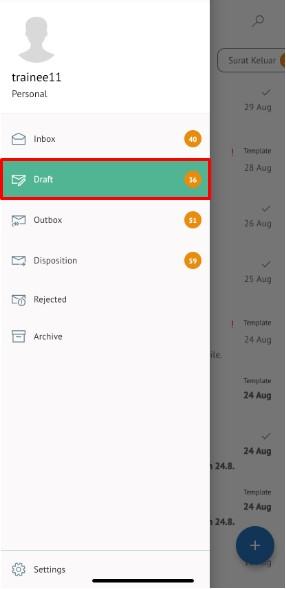 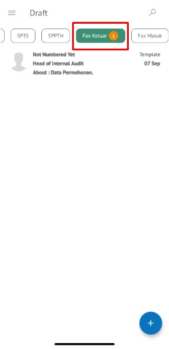

3. Pilih tombol **_User_ Template** untuk melanjutkan edit fax keluar

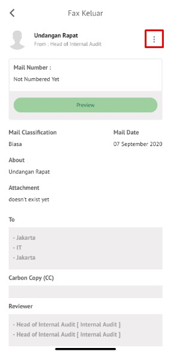 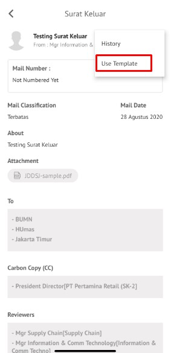

4. Sistem akan menampilkan form **Edit Correspondence,** klik **Simpan** untuk menyimpan perubahan

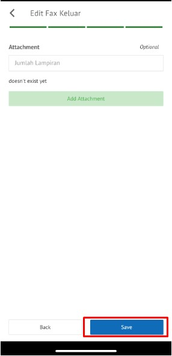

5. Lakukan perubahan pada fax, klik **Simpan** untuk menyimpan perubahan dan fax keluar akan tersimpan di menu **“Draft – Fax Keluar”** sebagai draft atau klik **Send** untuk mengirimkan ke pejabat tujuan dan tersimpan di menu **“Outbox – Fax Keluar”.**

## **P-Office Versi IOS**

Langkah - langkah untuk save as template fax keluar via IOS adalah sebagai berikut :

1. Isi _form_ fax keluar dan klik **Save as Template**

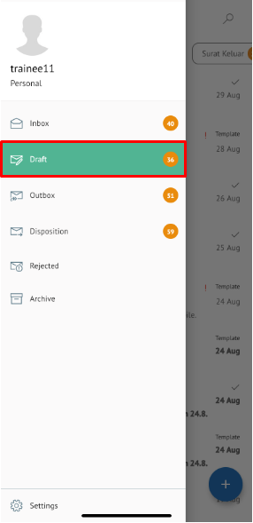 

2. Fax keluar yang disimpan menjadi _template_ akan tersimpan di menu “**Draft – Fax Keluar”. **Untuk melanjutkan _template_ yang sudah dibuat _user_ dapat memilih menu “**Draft – Fax Keluar**” kemudian pilih _template _yang akan digunakan

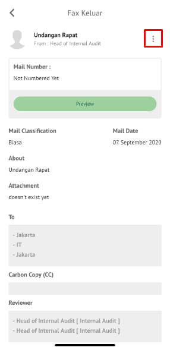 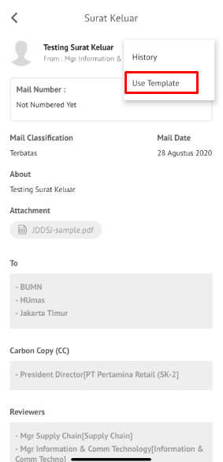

3. Pilih icon **Option** kemudian pilih **_Use_ Template** untuk melanjutkan edit surat akan menampilkan form **Edit Surat Keluar, **klik **Save** untuk menyimpan perubahan

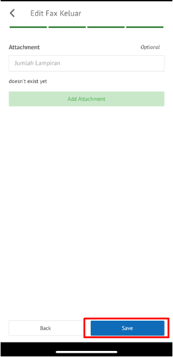 

4. perubahan pada surat, klik **Save** untuk menyimpan perubahan dan surat akan tersimpan di menu **“Draft – Fax Keluar”** sebagai draft atau klik **Send** untuk mengirimkan ke pejabat tujuan dan tersimpan di menu **“Outbox – Fax Keluar”.**

