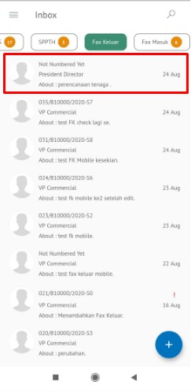

**Role yang sesuai**

- *Approver User*
- *Reviewer User*

*User* dapat menyetujui fax keluar yang sudah dilakukan review dan fax keluar akan dikirimkan ke *reviewer* selanjutnya atau *approver*. Langkah - langkah untuk menyetujui fax keluar adalah sebagai berikut

1. Klik menu **Inbox** dan pilih tab **Fax Keluar**

2. Pilih fax keluar yang akan ditindak lanjuti kemudian pilih tab **Detail**

3. Klik tombol **Approve** dan pilih **Send.** Isikan komentar jika diperlukan

4. Sistem berhasil menyimpan perubahan. Fax keluar yang sudah di kirim akan tersimpan di menu **Outbox - Fax Keluar**

## **P-Office Versi Teams**

Langkah - langkah untuk menyetujui fax keluar via Teams adalah sebagai berikut:

1. Klik menu **Inbox** dan pilih tab **Fax Keluar**

2. Pilih fax keluar yang akan ditindak lanjuti kemudian pilih tab **Detail**

3. Klik tombol **Approve** dan pilih **Send.** Isikan komentar jika diperlukan

4. Sistem berhasil menyimpan perubahan. Fax keluar yang sudah di kirim akan tersimpan di menu **Outbox - Fax Keluar**

## **P-Office Versi Android**

Langkah - langkah untuk menyetujui fax keluar via Android adalah sebagai berikut:

1. Klik menu **Inbox** dan pilih tab **Fax Keluar**

 

2. Pilih fax keluar yang akan ditindak lanjuti kemudian pilih icon **Option**
   
 

3. Klik tombol **Approve** kemudian Sistem akan menampilkan pop up konfirmasi dan _user_ harus mengisi komentar lalu pilih **Send**
   
 

4. Sistem berhasil menyimpan perubahan. Fax keluar yang sudah di kirim akan tersimpan di menu **Outbox- Fax Keluar**

## **P-Office Versi IOS**

Langkah - langkah untuk menyetujui fax keluar via IOS adalah sebagai berikut:

1. Klik menu **Inbox** dan pilih tab **Fax Keluar**

 

2. Pilih fax keluar yang akan ditindak lanjuti kemudian pilih icon **Option** dan pilih **Approve**

 

3.	Isikan komentar jika diperlukan kemudian klik **Send** untuk menyimpan perubahan. Fax keluar yang sudah di kirim akan tersimpan di menu **"Outbox – Fax Keluar"** 

