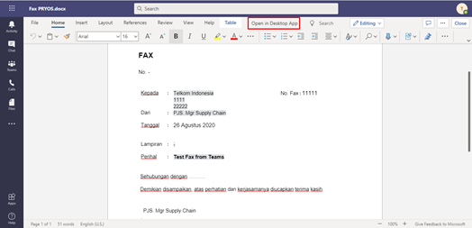
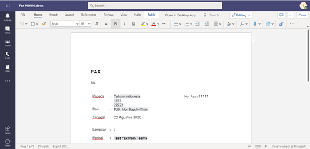

**Ditujukan kepada**

- *Approver User*
- *Reviewer User*

**Role yang sesuai**

- *Member User* (Pekerja)

*Member User* dapat menambah fax keluar pada aplikasi P-Office.

## **P-Office Versi Web**

Langkah - langkah untuk menambah fax keluar via Web adalah sebagai berikut :

1. Klik menu **New Correspondence**

2. Pilih jenis surat **"Fax Keluar"**

3. Isi *form* tambah fax keluar. Terdapat bebarapa aksi untuk menindaklanjuti fax keluar yang sudah diisi *form*nya yaitu **Save Fax Keluar**, **Send Fax Keluar** dan **Save as Template Fax Keluar.**

#### **Simpan Fax Keluar**

Langkah - langkah untuk menyimpan fax keluar adalah sebagai berikut

1. Isi *form* fax keluar kemudian klik **Save**

2. Sistem akan menampilkan tampilan *preview* fax keluar dalam bentuk Word yang dapat di edit. Untuk melakukan *editing* terhadap isi surat klik **Edit** kemudian sistem akan menampilkan *pop up* konfirmasi **Ubah Word Desktop** atau **Ubah Online**

#### **[Edit] Word Desktop**

Langkah - langkah untuk mengubah isi fax keluar melalui Word Desktop adalah sebagai berikut

1. Klik **Ubah di Word** untuk mengubah melalui aplikasi Microsoft Word

2. Lakukan perubahan pada isi surat. Klik **Close** pada aplikasi dan isi surat akan otomatis tersimpan

#### **[Edit] Ubah Online**
  
Langkah - langkah untuk mengubah isi fax keluar secara *online* adalah sebagai berikut

1. Klik **Ubah Online** untuk mengubah isi surat secara *online*

2. Lakukan perubahan pada isi surat. Klik **Close** pada aplikasi

3. Isi surat akan otomatis tersimpan. Jika surat akan disimpan sebagai draft, maka klik **Close.** 

4. Surat yang sudah selesai diubah maka akan tersimpan di menu **"Draft - Fax Keluar"**

#### **Kirim Fax Keluar**

Langkah - langkah untuk mengirim fax keluar adalah sebagai berikut

1. Pada tampilan *preview* fax keluar, klik **Kirim** untuk mengirim surat ke pejabat tujuan

2. Sistem menyimpan perubahan dan fax keluar akan tersimpan di menu **"Outbox - Fax keluar"**

## **P-Office Versi Teams**

Langkah - langkah untuk tambah fax keluar via Teams adalah sebagai berikut:

1. Klik menu **New Correspondence**

2. Pilih jenis surat **"Fax Keluar"**

3. Isi *form* tambah fax keluar. Terdapat bebarapa aksi untuk menindaklanjuti fax keluar yang sudah diisi formnya yaitu **Simpan Fax Keluar**, **Kirim Fax Keluar** dan **Save as Template Fax Keluar.**

#### **Simpan Fax Keluar**

Langkah - langkah untuk menyimpan fax keluar adalah sebagai berikut

1. Isi *form* fax keluar kemudian klik **Save**

2. Sistem akan menampilkan tampilan *preview* fax keluar dalam bentuk Word yang dapat di edit. Untuk melakukan *editing* terhadap isi surat klik **Ubah Isi** kemudian sistem akan menampilkan *pop up* konfirmasi **Ubah Word Desktop** atau **Ubah Online**

#### **[Edit] Word Desktop**

Langkah - langkah untuk mengubah isi fax keluar melalui Word Desktop adalah sebagai berikut

1. Klik **Open in Desktop App** untuk mengubah melalui aplikasi Microsoft Word

2. Lakukan perubahan pada isi surat. Klik **Close** pada aplikasi dan isi surat akan otomatis tersimpan

#### **[Edit] Ubah Online**
  
Langkah - langkah untuk mengubah isi fax keluar secara *online* adalah sebagai berikut

1.	Ketika Klik *button* **Edit Content** maka secara otomatis akan membuka dokumen dan bisa mengubah isi surat secara *online*

2. Lakukan perubahan pada isi surat. Klik **Close** pada aplikasi

3. Isi surat akan otomatis tersimpan. Jika surat akan disimpan sebagai draft, maka klik **Close.** 

4. Surat yang sudah selesai diubah maka akan tersimpan di menu **"Draft - Fax Keluar"**

#### **Kirim Fax Keluar**

Langkah - langkah untuk mengirim fax keluar adalah sebagai berikut

1. Pada tampilan *preview* fax keluar, klik **Send** untuk mengirim surat ke pejabat tujuan

2. Sistem menyimpan perubahan dan fax keluar akan tersimpan di menu **"Outbox - Fax keluar"**

## **P-Office Versi Android**

Langkah - langkah untuk tambah fax keluar via Android adalah sebagai berikut:

1. Klik ikon **(+)** pada fax keluar

2. Pilih jenis surat “**Fax Keluar**” lalu pilih **Next**

3. Isi _form_ tambah fax keluar. Terdapat bebarapa aksi untuk menindaklanjuti fax keluar yang sudah diisi _form_ nya yaitu **Save as template** dan **Save Mail**

  

#### **Simpan Fax Keluar**

Langkah – langkah untuk menyimpan fax keluar adalah sebagai berikut.

1. Isi _form_ fax keluar kemudian klik **Save mail** maka fax keluar tesimpan di menu **draft – fax keluar**

  

###### **Kirim Fax Keluar**

Langkah – langkah untuk mengirim fax keluar adalah sebagai berikut.

1. Setelah dilakukan perubahan pada konten isi surat, klik **Send** untuk mengirim fax ke pejabat tujuan.

1. Sistem menyimpan perubahan dan surat keluar akan tersimpan di menu “**Outbox - Surat Keluar**”

## **P-Office Versi IOS**

Langkah – langkah untuk menambah fax keluar via IOS adalah sebagai berikut :

Langkah-langkah untuk menambah fax keluar adalah sebagai berikut.

1. Klik menu **New Correspondence**

2. Pilih jenis surat “**Fax Keluar**” klik **Next **untuk melanjutkan pengisian form

3. Isi _form_ tambah fax keluar. Terdapat bebarapa aksi untuk menindaklanjuti fax keluar yang sudah diisi _form_nya yaitu **Simpan Fax keluar**, **Kirim Fax keluar** dan **Save as Template Fax keluar.**

###### **Simpan Fax Keluar**

Langkah – langkah untuk menyimpan fax keluar adalah sebagai berikut :

1. Isi _form_ fax keluar kemudian klik **Save**

2. Pilih **Save Email** untuk menyimpan form fax keluar sebagai draft

3. Sistem akan menampilkan tampilan _preview_ fax keluar dalam bentuk Word yang dapat di edit. Untuk melakukan _editing_ terhadap isi surat klik **Edit/Send**

 

4. Pilih **Edit Content,** kemudian aplikasi akan menampilkan editor Word Online. Lakukan perubahan pada isi konten, kemudian close editor Word Online. Sistem akan menampilkan _pop up _notifikasi editing dokumen, klik **Yes** untuk menutup _pop up_ notifikasi

 

6. Fax keluar yang sudah di ubah akan tersimpan dimenu “**Draft – Surat Keluar**”

###### **Kirim Fax Keluar**

Langkah – langkah untuk mengirim fax keluar adalah sebagai berikut :

1. Setelah dilakukan perubahan pada konten isi surat, klik **Send** untuk mengirim fax ke pejabat tujuan.

2. Sistem menyimpan perubahan dan surat keluar akan tersimpan di menu “**Outbox - Surat Keluar**”

