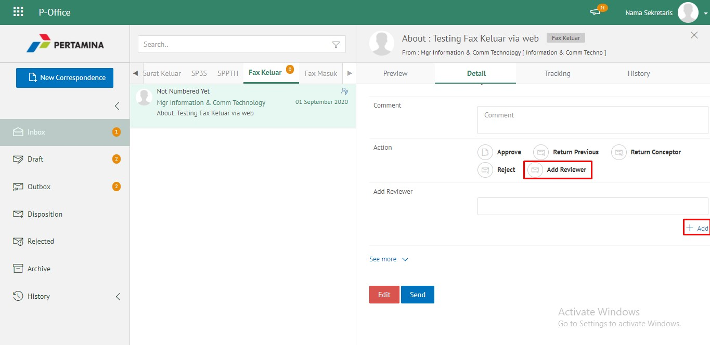
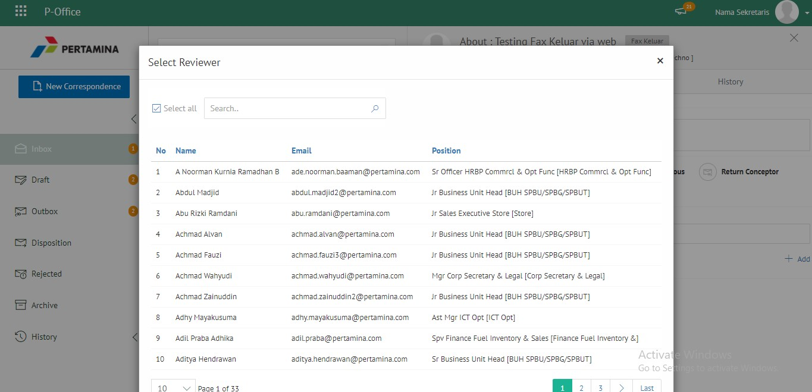
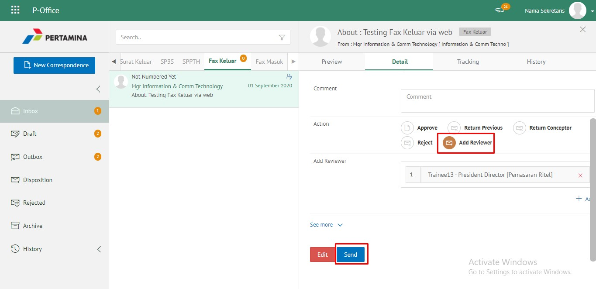
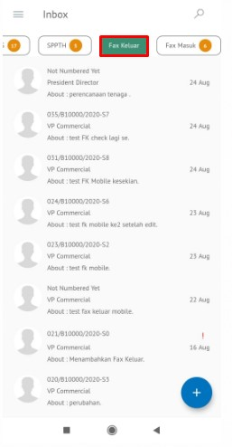
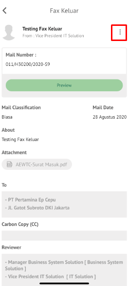
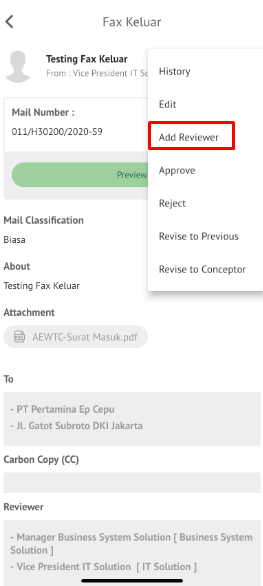
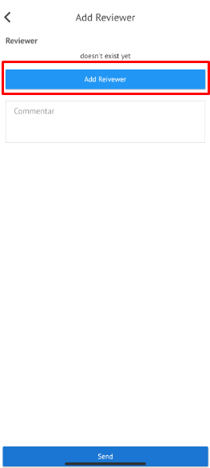
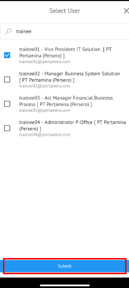
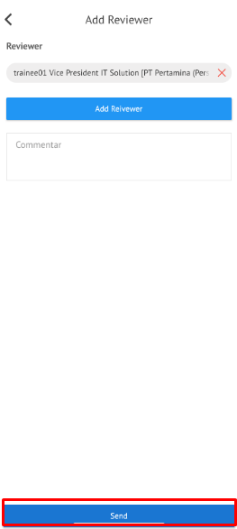

**Role yang sesuai**

- *Approver User*

*Approver User* dapat menambahkan reviewer kemudian fax keluar akan diteruskan ke reviewer baru. Langkah - langkah untuk menambah reviewer fax keluar adalah sebagai berikut

1. Klik menu **Inbox** dan pilih tab **Fax Keluar**

2. Pilih fax keluar yang akan ditindak lanjuti kemudian pilih tab **Detail**

3. Klik tombol **Add Reviewer** dan pilih pejabat yang akan melakukan review dengan meng-klik tombol "+" pada field **Add Reviewer**

4. Sistem akan menampilkan pejabat untuk dijadikan reviewer baru

5. Pilih **Send** untuk mengirimkan kepada pejabat/reviewer yang dituju dan fax keluar akan tersimpan di menu **"Outbox - Fax Keluar"**. Untuk pejabat/reviewer baru akan menerima fax keluar di menu **"Inbox - Fax Keluar"**. Untuk penomoran fax keluar proesenya akan tetap berada di role approver/pemilik KBO, sehingga setelah flow penambahan reviewer baru selesai, fax keluar akan kembali ke approver/pemilik KBO

## **P-Office Versi Teams**

Langkah - langkah untuk tambah reviewer via Teams adalah sebagai berikut:

1. Klik menu **Inbox** dan pilih tab **Fax Keluar**

2. Pilih fax keluar yang akan ditindak lanjuti kemudian pilih tab **Detail**

3. Klik tombol **Add Reviewer** dan pilih pejabat yang akan melakukan review dengan meng-klik tombol "+" pada field **Add Reviewer**

4. Sistem akan menampilkan pejabat untuk dijadikan reviewer baru

5. Pilih **Send** untuk mengirimkan kepada pejabat/reviewer yang dituju dan fax keluar akan tersimpan di menu **"Outbox - Fax Keluar"**. Untuk pejabat/reviewer baru akan menerima fax keluar di menu **"Inbox - Fax Keluar"**. Untuk penomoran fax keluar proesenya akan tetap berada di role approver/pemilik KBO, sehingga setelah flow penambahan reviewer baru selesai, fax keluar akan kembali ke approver/pemilik KBO

 

## **P-Office Versi Android**

Langkah - langkah untuk tambah reviewer via Android adalah sebagai berikut:

1. Klik menu **Inbox** dan pilih tab **Fax Keluar**

 

2. Pilih fax keluar yang akan ditindak lanjuti kemudian pada **Detail** klik icon **Option** kemudian pilih **Add Reviewer**

 

3. Klik tombol **Add Reviewer** dan pilih pejabat yang akan melakukan review dengan meng-klik pada field **Add Reviewer**
   

4. Sistem akan menampilkan pejabat untuk dijadikan reviewer baru

5. Pilih **Send** untuk mengirimkan kepada pejabat/reviewer yang dituju dan fax keluar akan tersimpan di menu “**Outbox - Fax Keluar**”. Untuk pejabat/reviewer baru akan menerima fax keluar di menu “**Inbox – Fax Keluar**”. Untuk penomoran fax keluar proesenya akan tetap berada di role approver/pemilik KBO, sehingga setelah flow penambahan reviewer baru selesai, fax keluar akan kembali ke approver/pemilik KBO

## **P-Office Versi IOS**

Langkah - langkah untuk tambah reviewer via IOS adalah sebagai berikut:

1. Klik menu **Inbox** dan pilih tab **Fax Keluar**

 

2. Pilih fax keluar yang akan ditindak lanjuti kemudian pilih icon **Option** dan pilih **Add Reviewer**

 

3.	Klik **Add Reviewer** untuk menampilkan daftar pejabat yang akan dipilih sebagai reviewer baru

4.  Sistem menampilkan daftar pejabat yang akan ditambah sebagai reviewer baru, checklist pada pejabat kemudian klik **Submit**

5.  Isikan komentar jika diperlukan, kemudian klik **Send** untuk mengirimkan fax keluar ke reviewer baru

6.  Fax keluar yang sudah dikirimkan kepada reviewer baru akan tersimpan di menu **"Outbox - Fax Keluar"** pejabat pengirim fax keluar. Sedangkan untuk pejabat reviewer baru akan terima di menu **"Inbox - Fax Keluar"**. Untuk penomoran fax keluar proesenya akan tetap berada di role approver/pemilik KBO, sehingga setelah flow penambahan reviewer baru selesai, fax keluar akan kembali ke approver/pemilik KBO

