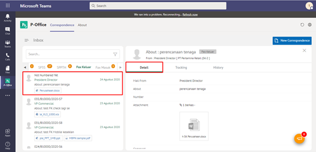

**Role yang sesuai**

- *Approver User*
- *Reviewer User*

*User* dapat menolak fax keluar yang akan dikemnbalikan ke konseptor jika hasil review fax keluar belum / tidak sesuai. Langkah-langkah untuk menolak fax keluar adalah sebagai berikut

1. Klik menu **Inbox** dan pilih tab **Fax Keluar**

2. Pilih fax keluar yang akan ditindak lanjuti kemudian pilih tab **Detail**

3. Klik tombol **Reject** dan pilih **Send**. Isikan komentar jika diperlukan

4.	Sistem berhasil menyimpan perubahan. Fax keluar yang sudah di tolak akan akan akan terhapus dari aplikasi akan tersimpan di menu **“Rejected – Memorandum”** user penolak dengan label **Rejected**.

## **P-Office Versi Teams**

Langkah - langkah untuk tolak fax keluar via Teams adalah sebagai berikut:

1. Klik menu **Inbox** dan pilih tab **Fax Keluar**

2. Pilih fax keluar yang akan ditindak lanjuti kemudian pilih tab **Detail**

3. Klik tombol **Reject** dan pilih **Send**. Isikan komentar jika diperlukan

4.	Sistem berhasil menyimpan perubahan. Fax keluar yang sudah di tolak akan akan akan terhapus dari aplikasi akan tersimpan di menu **“Rejected – Memorandum”** user penolak dengan label **Rejected**.

## **P-Office Versi Android**

Langkah - langkah untuk tolak fax keluar via Android adalah sebagai berikut:

1. Klik menu **Inbox** dan pilih tab **Fax Keluar**

 

2. Pilih fax keluar yang akan ditindak lanjuti kemudian pilih icon **Option**

  

3. Klik tombol **Reject** kemudian sistem menampilkan pop up dan user mengisi komentar lalu klik **Send**

 

5. Sistem berhasil menyimpan perubahan fax keluar yang sudah di tolak akan tersimpan dimenu “**Rejected- Fax Keluar”** user penolak pada label “**Rejected”**

## **P-Office Versi Android**

Langkah - langkah untuk tolak fax keluar via Android adalah sebagai berikut:

1. Klik menu **Inbox** dan pilih tab **Fax Keluar**

 

2. Pilih fax keluar yang akan ditindak lanjuti kemudian pilih icon **Option** dan pilih **Reject**

 

3.	Isikan komentar jika diperlukan kemudian klik **Send** untuk menyimpan perubahan

4. Sistem berhasil menyimpan perubahan fax keluar yang sudah di tolak akan tersimpan dimenu “**Rejected- Fax Keluar”** user penolak pada label “**Rejected”**

