**Role yang sesuai**

- *Approver User*
- *Reviewer User*

*User* dapat melakukan *custom* penerima disposisi terhadap pejabat penerima yang akan menerima perintah disposisi. Secara *default* pejabat yang akan menerima disposisi adalah pejabat yang ada dibawahnya. Tetapi terdapat *case* jika *user* membutuhkan *custom* penerima disposisi sehingga disediakan fitur untuk memilih pejabat selain pejabat yang ada dibawahnya. 

## **P-Office Versi Web**

Langkah-langkah untuk melakukan custom disposisi fax masuk Web adalah sebagai berikut :

1. Klik menu **Inbox** dan pilih tab **Fax Masuk**

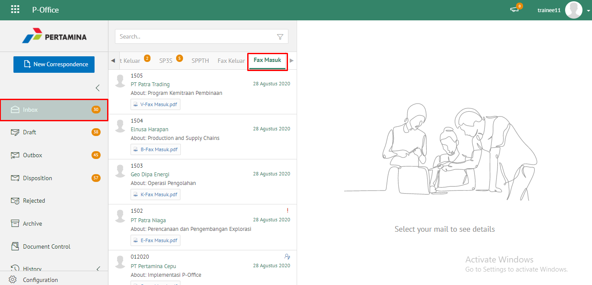 

2. Pilih fax masuk yang akan didisposisikan kemudian pilih tab **Detail**

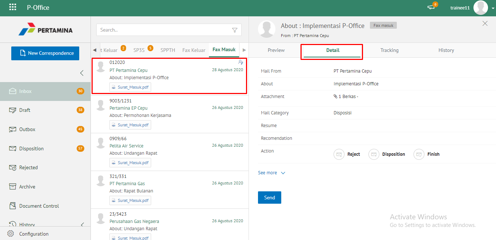

3. Klik tombol **Disposisi** dan pilih **Send**

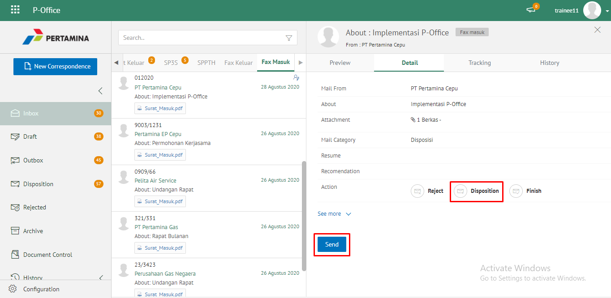 

4. Sistem menampilkan form disposisi. Klik icon **"+"** pada field **Forward To.** Isikan informasi disposisi dan perintah untuk masing - masing penerima disposisi.

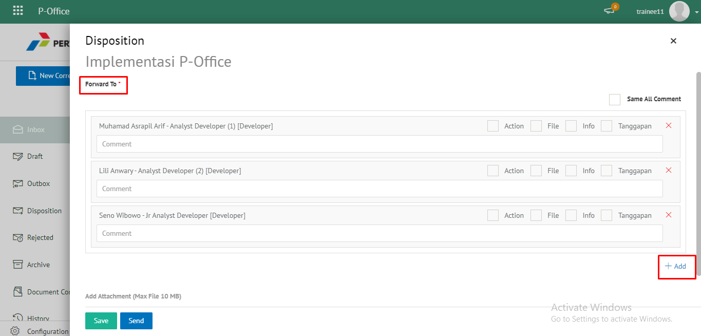 

5. Sistem menampilkan daftar pejabat yang dapat dipilih untuk didisposikan

6. Isikan perintah dan keterangan pada masing - masing penerima disposisi. Tambahkan lampiran disposisi jika diperlukan. Fitur **Same All Comment** dapat digunakan *user* untuk memberikan komentar yang sama untuk masing - masing pejabat penerima disposisi. Klik **Save** untuk menyimpan perubahan dan klik **Send** untuk mengirim disposisi.

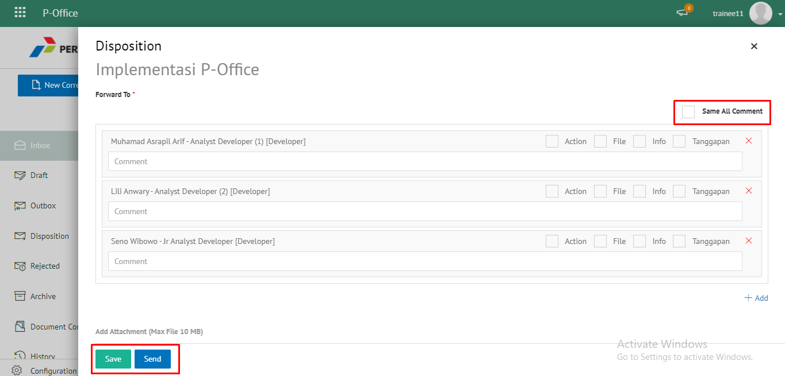 

## **P-Office Versi Teams**

Langkah - langkah untuk custom disposisi fax masuk via Teams adalah sebagai berikut:

1. Klik menu **Inbox** dan pilih tab **Fax Masuk**

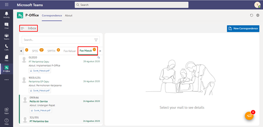

2. Pilih fax masuk yang akan didisposisikan kemudian pilih tab **Detail**

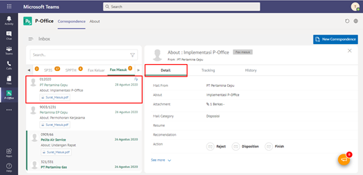

3. Klik tombol **Disposisi** dan pilih **Send**

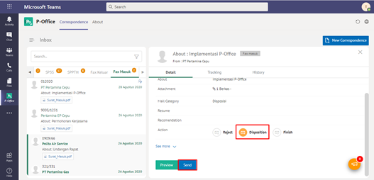

4. Sistem menampilkan form disposisi. Klik icon "+" pada field **Forward To**. Isikan informasi disposisi dan perintah untuk masing - masing penerima disposisi.

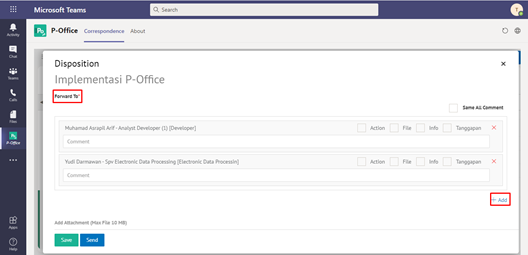

5. Sistem menampilkan daftar pejabat yang dapat dipilih untuk didisposikan

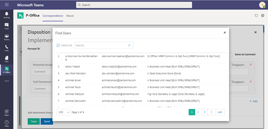

6. Isikan perintah dan keterangan pada masing - masing penerima disposisi. Tambahkan lampiran disposisi jika diperlukan. Fitur **Same All Comment** dapat digunakan *user* untuk memberikan komentar yang sama untuk masing - masing pejabat penerima disposisi. Klik **Save** untuk menyimpan perubahan dan klik **Send** untuk mengirim disposisi.

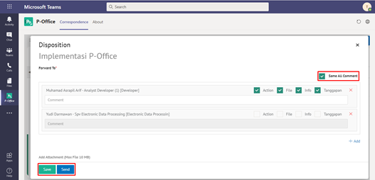

## **P-Office Versi Android**

Langkah-langkah untuk Custom Disposisi fax masuk via Android adalah sebagai berikut :

1. Klik menu **Inbox** dan pilih tab **Fax Masuk**

 

2. Pilih fax masuk yang akan didisposisikan kemudian pilih icon **Option**

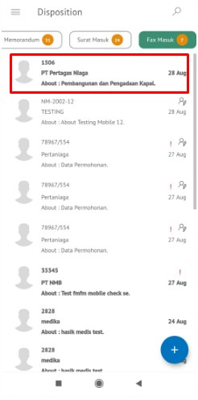 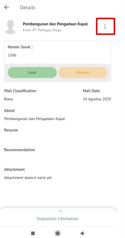

3. Klik tombol **Disposition**

4. Sistem menampilkan form disposisi. Klik icon **“+”** pada field **Forward To**. Isikan informasi disposisi dan perintah untuk masing-masing penerima disposisi.

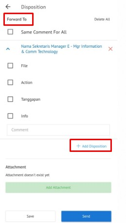

5. Sistem menampilkan daftar pejabat yang dapat dipilih untuk didisposikan

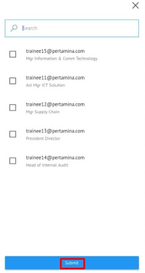

6. Isikan perintah dan keterangan pada masing-masing penerima disposisi. Tambahkan lampiran disposisi jika diperlukan. Fitur **Same All Comment** dapat digunakan _user_ untuk memberikan komentar yang sama untuk masing-masing pejabat penerima disposisi. Klik **Save**  menyimpan perubahan dan klik **Send** untuk mengirim disposisi.

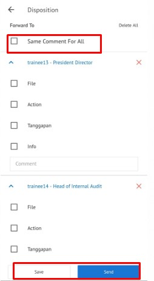

## **P-Office Versi IOS**

Langkah-langkah untuk melakukan Custom disposisi fax masuk via IOS adalah sebagai berikut : 

1. Klik menu **Inbox** dan pilih tab **Fax Masuk**

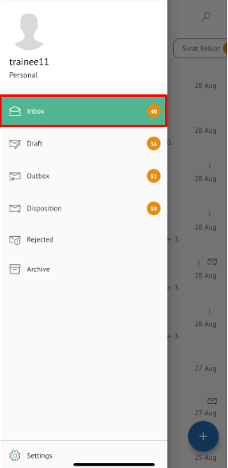 

2. Pilih fax masuk yang akan didisposisikan kemudian pilih icon **Option** dan pilih **Disposition**

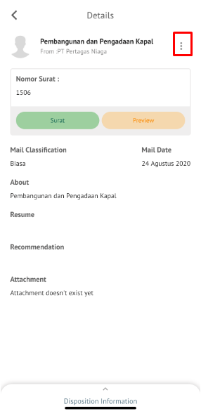 

3. Menampilkan form disposisi. Klik icon “**+ Add Disposition**” pada field **Forward To.** Isikan informasi disposisi dan perintah untuk masing-masing penerima disposisi.

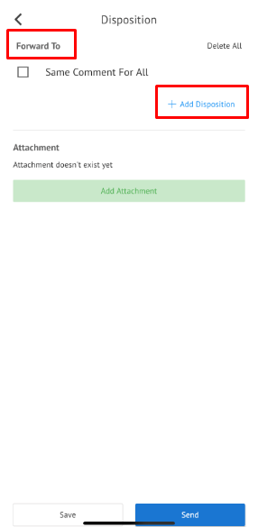

4. Sistem menampilkan daftar pejabat yang dapat dipilih untuk didisposikan kemudian klik **Submit** untuk menambah pejabat penerima disposisi

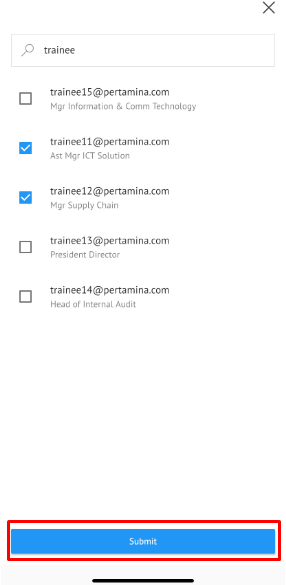

5. Isikan perintah dan keterangan pada masing-masing penerima disposisi. Tambahkan lampiran disposisi jika diperlukan. **Same Comment For All** dapat digunakan _user_ untuk memberikan komentar yang sama untuk masing-masing pejabat penerima disposisi. Klik **Save** untuk menyimpan perubahan dan klik **Send** untuk mengirim disposisi.

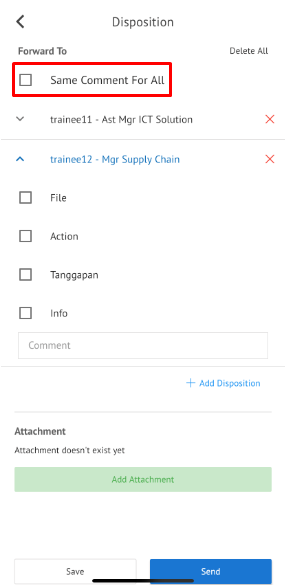