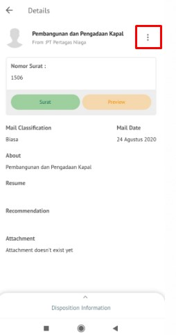

**Role yang sesuai**

- *Approver User*
- *Reviewer User*

*User* menerima fax masuk baru di menu **"Inbox - Fax Masuk"**. Fax masuk dapat didisposisikan kepada pejabat yang dipilih atau pejabat yang ada dibawahnya. Disposisi fax masuk dapat dilakukan dengan dua cara yaitu melalui menu **Inbox** jika fax masuk yang diterima merupakan surat masuk yang ditujukan langsung dari sekretaris ke pejabat pemilik KBOnya atau melalui menu **Disposisi** jika fax masuk sudah dilakukan tindak lanjut oleh pejabat pemilik KBO dan pemilik KBO akan mendisposisikan ke pejabat selanjutnya atau pejabat yang ada dibawahnya. Langkah - langkah untuk mendisposisikan fax masuk adalah sebagai berikut:

#### **Disposisi melalui Menu Inbox**

1. Klik menu **Inbox** dan pilih tab **Fax Masuk**

 

2. Pilih fax masuk yang akan didisposisikan kemudian pilih tab **Detail**

 

3. Klik tombol **Disposisi** dan pilih **Send**
    

4. Sistem menampilkan form disposisi. Isikan informasi disposisi dan perintah untuk masing - masing penerima disposisi.

 

5. Klik **Simpan** untuk menyimpan draft disposisi surat masuk dan surat masuk akan tersimpan di menu **"Draft - Surat masuk"**. Klik **Send** untuk mengirim disposisi ketujuan dan disposisi surat masuk akan tersimpan di menu **"Outbox - Disposisi"**.

#### **Disposisi melalui Menu Disposisi**

1. Klik menu **Disposisi** dan pilih tab **Fax Masuk**

 

2. Pilih fax masuk yang akan didisposisikan kemudian pilih tab **Detail**

 

3. Klik tombol **Disposisi** dan pilih **Send**

 

4. Sistem menampilkan form disposisi. Isikan informasi disposisi dan perintah untuk masing - masing penerima disposisi.

 

5. Klik Simpan untuk menyimpan draft disposisi fax masuk dan fax masuk akan tersimpan di menu "Draft - Surat masuk". Klik Send untuk mengirim disposisi ketujuan dan disposisi surat masuk akan tersimpan di menu "Outbox - Disposisi".

## **P-Office Versi Teams**

Langkah - langkah untuk disposisi fax masuk via Teams adalah sebagai berikut:

#### **Disposisi melalui Menu Inbox**

1. Klik menu **Disposisi** dan pilih tab **Fax Masuk**

2. Pilih fax masuk yang akan didisposisikan kemudian pilih tab **Detail**

3. Klik tombol **Disposition** dan pilih **Send**

4. Sistem menampilkan form disposisi. Isikan informasi disposisi dan perintah untuk masing - masing penerima disposisi.

5. Klik **Save** untuk menyimpan draft disposisi fax masuk dan fax masuk akan tersimpan di menu **"Draft - Surat masuk"**. Klik **Send** untuk mengirim disposisi ketujuan dan disposisi surat masuk akan tersimpan di menu **"Outbox - Disposisi"**.

#### **Disposisi melalui Menu Disposisi**

1. Klik menu **Disposisi** dan pilih tab **Fax Masuk**

2. Pilih fax masuk yang akan didisposisikan kemudian pilih tab **Detail**

3. Klik tombol **Disposition** dan pilih **Send**

4. Sistem menampilkan form disposisi. Isikan informasi disposisi dan perintah untuk masing - masing penerima disposisi.

5. Klik **Save** untuk menyimpan draft disposisi fax masuk dan fax masuk akan tersimpan di menu **"Draft - Surat masuk"**. Klik **Send** untuk mengirim disposisi ketujuan dan disposisi surat masuk akan tersimpan di menu **"Outbox - Disposisi"**.

## **P-Office Versi Android**

Langkah-langkah untuk mendisposisikan fax masuk adalah sebagai berikut :

**Disposisi melalui Menu Inbox**

1. Klik menu **Inbox** dan pilih tab **Fax Masuk**

 

2. Pilih fax masuk yang akan didisposisikan kemudian pilih ikon **tombol button**

 

3. Klik tombol **Disposisi** pada ikon button

4. 	Sistem menampilkan form disposisi. Isikan informasi disposisi dan perintah untuk masing-masing penerima disposisi.

5. Klik **Simpan** untuk menyimpan draft disposisi surat masuk dan surat masuk akan tersimpan di menu “**Draft – Surat masuk**”. Klik **Send** untuk mengirim disposisi ketujuan dan disposisi surat masuk akan tersimpan di menu “**Outbox – Disposisi**”.

**Disposisi melalui Menu Disposisi**

1. Klik menu **Disposisi** dan pilih tab **Fax Masuk**

 

2. Pilih fax masuk yang akan didisposisikan kemudian pilih ikon **tombol button**

 

3. Klik tombol **Disposisi** pada ikon button

4. Sistem menampilkan form disposisi. Isikan informasi disposisi dan perintah untuk masing-masing penerima disposisi.

5. Klik Simpan untuk menyimpan draft disposisi fax masuk dan fax masuk akan tersimpan di menu **“Draft – Surat masuk**”. Klik **Send** untuk mengirim disposisi ketujuan dan disposisi surat masuk akan tersimpan di menu **“Outbox – Disposisi”**

