**Role yang sesuai**

- Sekretaris

Sekretaris dapat melakukan _drafting_ fax masuk pada aplikasi P-Office. _Drafting_ fax masuk dilakukan jika sekretaris akan meneruskan dan melakukan perubahan pada fax masuk yang sudah disimpan pada menu **Draft.** 

## **P-Office Versi Web**

Langkah-langkah untuk melakukan drafting fax masuk via Web adalah sebagai berikut :

1.    Klik menu **Draft** dan pilih tab **Fax Masuk**

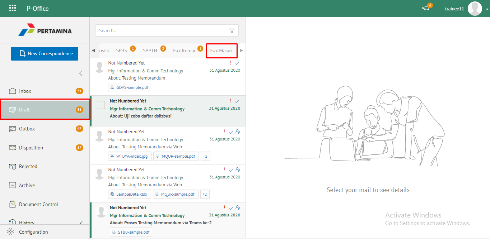 

1. Pilih fax masuk yang akan diubah. Pilih tab **Detail** kemudian klik **Edit**

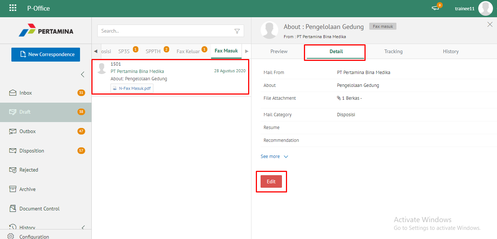 

2. Sistem akan menampilkan _form_ **Edit Correspondence**

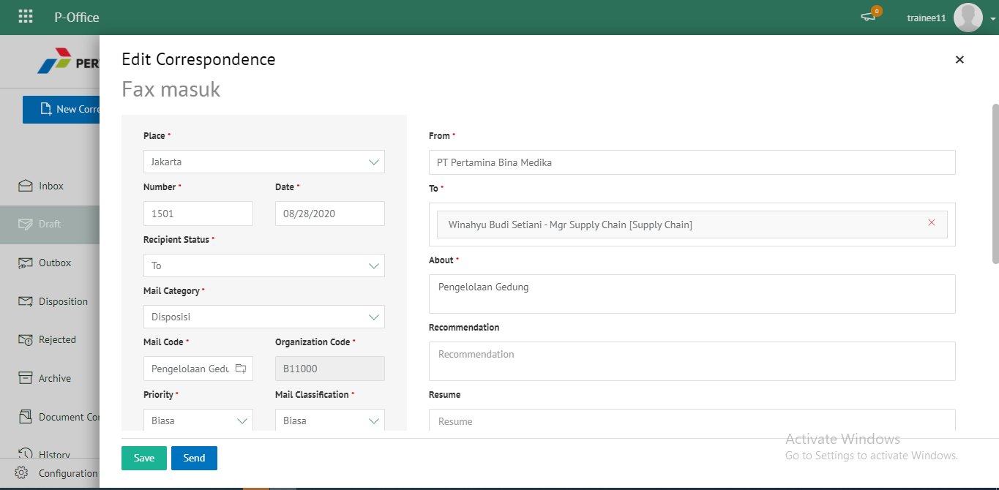 

1. Lakukan perubahan pada _form_. Klik **Send** untuk mengirim fax masuk ke pejabat tujuan. Surat yang terkirim akan tersimpan di menu "**Outbox - Fax Masuk"**

 

## **P-Office Versi Teams**

Langkah - langkah untuk drafting fax masuk via Teams adalah sebagai berikut:

1. Klik menu **Draft** dan pilih tab **Fax Masuk**

1. Pilih fax masuk yang akan diubah. Pilih tab **Detail** kemudian klik **Edit**

1. Sistem akan menampilkan _form_ **Edit Correspondence**

4.	  Lakukan perubahan pada _form_. Klik **Send** untuk mengirim fax masuk ke pejabat tujuan. Surat yang tersimpan akan ada di **“Draf – Fax Masuk”** dan surat yang terkirim akan tersimpan di menu **“Outbox – Fax masuk”** 

## **P-Office Versi Android**

Langkah-langkah untuk Drafting fax masuk adalah sebagai berikut :

1. Klik menu **Draft** dan pilih tab **Fax Masuk**

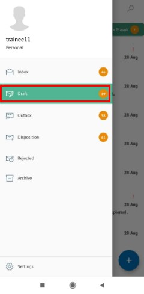 
 

2. Pilih fax masuk yang akan diubah. Pilih ikon **tombol button** kemudian klik **Edit**

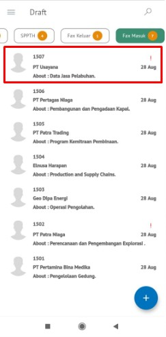 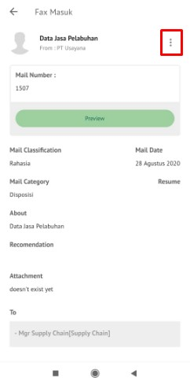

3. Sistem akan menampilkan _form_ **Edit Correspondence**

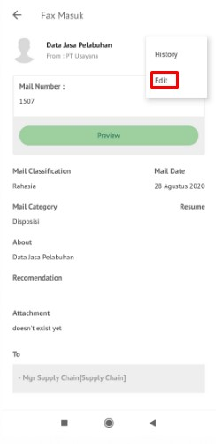

4. Lakukan perubahan pada _form_. Klik **Send **untuk mengirim fax masuk ke pejabat tujuan. Surat yang terkirim akan tersimpan di menu “**Outbox – Fax masuk”**
   
    ## **P-Office Versi IOS**

Langkah-langkah untuk melakukan drafting fax masuk via IOS dalah sebagai berikut :

1. Klik menu **Draft** dan pilih tab **Fax Masuk**

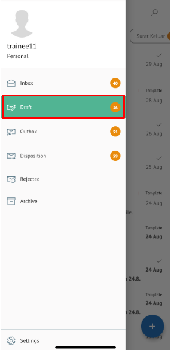 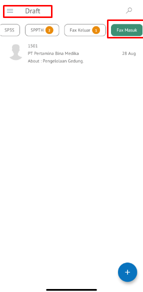

2. Pilih fax masuk yang akan diubah. Pilih icon **Option** kemudian klik **Edit**

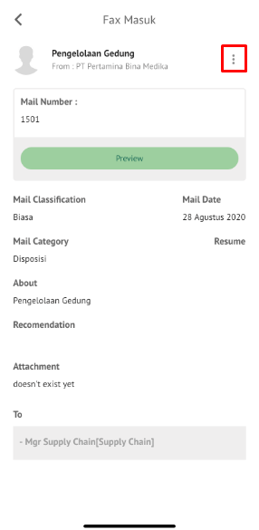 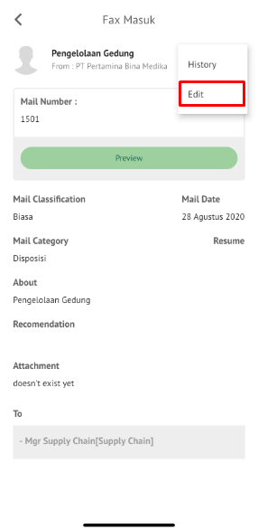

3. Sistem akan menampilkan _form_ **Edit Correspondence**
   
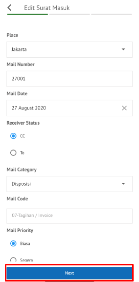 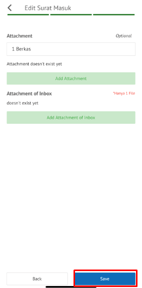

4. Lakukan perubahan pada _form_. Klik **Send** untuk mengirim fax masuk ke pejabat tujuan. Surat yang terkirim akan tersimpan di menu “**Outbox – Fax Masuk”**

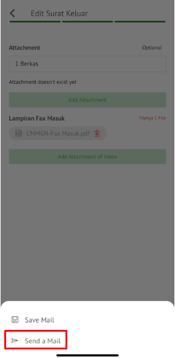
