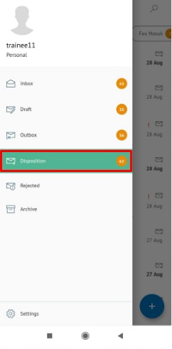

**Role yang sesuai**

- *Approver User*
- *Reviewer User*
- *Member User* (Pekerja)

*User* dapat melihat daftar fax masuk pada pada menu **Inbox atau Disposisi** pada masing - masing akun. Langkah - langkah untuk melihat daftar fax masuk adalah sebagai berikut

1. Klik menu **Inbox / Disposisi** dan pilih tab **Fax Masuk**

 

## **P-Office Versi Teams**

Langkah - langkah untuk melihat daftar disposisi fax masuk via Teams adalah sebagai berikut:

1. Klik menu **Inbox / Disposisi** dan pilih tab **Fax Masuk**

## **P-Office Versi Android**

Langkah-langkah untuk melihat daftar fax masuk adalah sebagai berikut :

1. Klik menu **Inbox / Disposisi** dan pilih tab **Fax Masuk**

  
