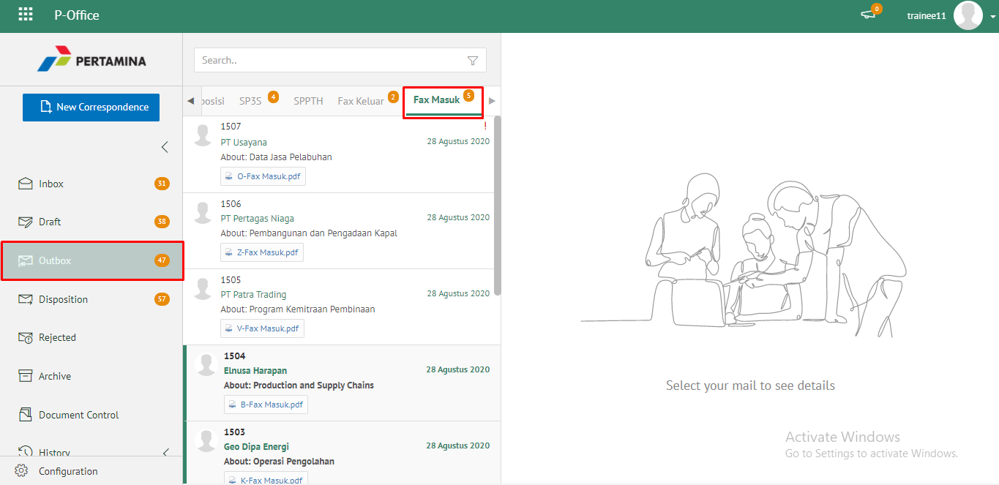
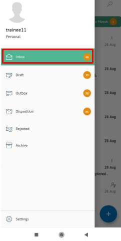
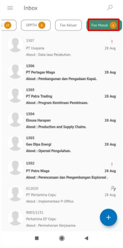
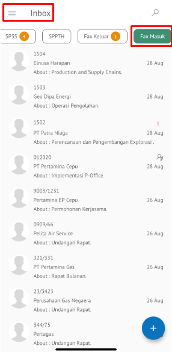

**Role yang sesuai**

- *Approver User*
- *Reviewer User*
- *Member User* (Pekerja)

*User* dapat melihat daftar fax masuk yang ditujukan pada sekretaris tersebut. 

## **P-Office Versi Web**

Langkah - langkah untuk melihat daftar fax masuk via Web adalah sebagai berikut :

1. Klik menu **Inbox/Draft/Outbox** dan pilih tab **Fax Masuk**. Sistem akan menampilkan daftar fax masuk yang ditujukan pada sekretaris

 

## **P-Office Versi Teams**

Langkah - langkah untuk melihat daftar fax masuk via Teams adalah sebagai berikut:

1. Klik menu **Inbox/Draft/Outbox** dan pilih tab **Fax Masuk**. Sistem akan menampilkan daftar fax masuk yang ditujukan pada sekretaris

## **P-Office Versi Android**

Langkah-langkah untuk melihat daftar fax masuk adalah sebagai berikut :

1. Klik menu **Inbox/Draft/Outbox** dan pilih tab **Fax Masuk**.Sistem akan menampilkan daftar fax masuk yang ditujukan pada sekretaris

  

## **P-Office Versi IOS**

Langkah - langkah untuk melihat daftar fax masuk via Teams adalah sebagai berikut :

1. Klik menu **Inbox/Draft/Outbox** dan pilih tab **Fax Masuk**. Sistem akan menampilkan daftar fax masuk yang ditujukan pada sekretaris

