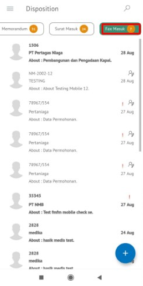
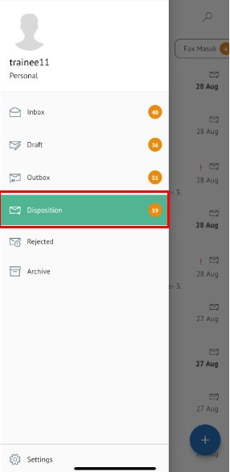
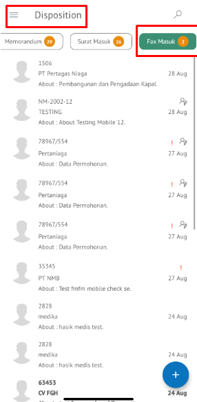

**Role yang sesuai**

- *Approver User*
- *Reviewer User*
- *Member User* (Pekerja)
- Sekretaris

*User* dapat melihat informasi lengkap fax masuk termasuk *preview* fax masuk, lembar penerus disposisi, detail fax masuk, *tracking* fax masuk dan *history* fax masuk.

# **P-Office Versi Web**

Langkah - langkah untuk melihat informasi disposisi fax masuk via Web adalah sebagai berikut :

1. Klik menu **Disposisi** dan pilih tab **Fax Masuk.** Pilih salah satu fax masuk yang akan dilihat informasinya

 

#### **Preview Fax Masuk**

Pada tab **Mail**, ditampilkan informasi fax masuk fisik yang sudah di *scan* dan kemudian diunggah oleh sekretaris / konseptor

 

#### **Preview Lembar Penerus**

Pada tab **Preview**, ditampilkan informasi lembar penerus disposisi yang berisi informasi daftar nama pejabat dan perintah disposisi yang harus dilakukan oleh pejabat penerima disposisi

 

#### **Detail Fax Masuk**

Pada tab **Detail**, terdapat informasi asal surat, perihal, file lampiran, nomor surat, klasifikasi surat, tanggal surat dan tujuan surat serta informasi disposisi yang mencakup lampiran disposisi, tujuan, tindak lanjut dan disposisi permasing-masing pejabat penerima disposisi

 

#### **Tracking Fax Masuk**

Pada tab **Tracking**, ditampilkan informasi *tracking* fax masuk dalam bentuk *chart*

 

#### **History Fax Masuk**

Pada tab **History**, ditampilkan riwayat fax masuk yang terdapat informasi jabatan, tanggal, tindakan dan komentar

 

## **P-Office Versi Teams**

Langkah - langkah untuk melihat informasi disposisi fax masuk via Teams adalah sebagai berikut:

1. Klik menu **Disposition** dan pilih tab **Fax Masuk.** Pilih salah satu fax masuk yang akan dilihat informasinya

 

#### **Preview Fax Masuk**

Pada tab **Mail**, ditampilkan informasi fax masuk fisik yang sudah di *scan* dan kemudian diunggah oleh sekretaris / konseptor

 

 

#### **Preview Lembar Penerus**

Pada tab **Preview**, ditampilkan informasi lembar penerus disposisi yang berisi informasi daftar nama pejabat dan perintah disposisi yang harus dilakukan oleh pejabat penerima disposisi

 

 

#### **Detail Fax Masuk**

Pada tab **Detail**, terdapat informasi asal surat, perihal, file lampiran, nomor surat, klasifikasi surat, tanggal surat dan tujuan surat serta informasi disposisi yang mencakup lampiran disposisi, tujuan, tindak lanjut dan disposisi permasing-masing pejabat penerima disposisi

  

#### **Tracking Fax Masuk**

Pada tab **Tracking**, ditampilkan informasi *tracking* fax masuk dalam bentuk *chart*

  

#### **History Fax Masuk**

Pada tab **History**, ditampilkan riwayat fax masuk yang terdapat informasi jabatan, tanggal, tindakan dan komentar

 

## **P-Office Versi Android**

Langkah-langkah untuk melihat informasi disposisi fax masuk via Android adalah sebagai berikut :

1. Klik menu **Disposisi** dan pilih tab **Fax Masuk** Pilih salah satu fax masuk yang akan dilihat informasinya

  

#### **Preview Fax Masuk**

Pada tombol **Preview**, ditampilkan informasi fax masuk fisik yang sudah di _scan_ dan kemudian diunggah oleh sekretaris / konseptor

 

#### **Detail Fax Masuk**

Pada **Detail**, terdapat informasi asal surat, perihal, file lampiran, nomor surat, klasifikasi surat, tanggal surat  tujuan surat dan informasi disposisi

#### **Preview Lembar Penerus**

Pada tombol **Preview,** ditampilkan informasi lembar penerus disposisi yang berisi informasi daftar nama pejabat dan perintah disposisi yang harus dilakukan oleh pejabat penerima disposisi serta informasi disposisi yang mencakup lampiran disposisi, tujuan, tindak lanjut dan disposisi permasing-masing pejabat penerima disposisi

 

#### **History Fax Masuk**

Pada pilihan **History**, ditampilkan riwayat fax masuk yang terdapat informasi jabatan, tanggal, tindakan dan komentar

 

# **P-Office Versi IOS**

Langkah-langkah untuk melihat informasi disposisi fax masuk via IOS adalah sebagai berikut :

1. Klik menu **Disposisi** dan pilih tab **Fax Masuk.** Pilih salah satu fax masuk yang akan dilihat informasinya

 

###### **Preview Fax Masuk**

Pada tab **Surat**, ditampilkan informasi fax masuk fisik yang sudah di _scan_ dan kemudian diunggah oleh sekretaris / konseptor

###### **Preview Lembar Penerus**

Pada tab **Preview,** ditampilkan informasi lembar penerus disposisi yang berisi informasi daftar nama pejabat dan perintah disposisi yang harus dilakukan oleh pejabat penerima disposisi

 

###### **Detail Fax Masuk**

Pada **Detail**, terdapat informasi asal surat, perihal, file lampiran, nomor surat, klasifikasi surat, tanggal surat dan tujuan surat serta informasi disposisi yang mencakup lampiran disposisi, tujuan, tindak lanjut dan disposisi permasing-masing pejabat penerima disposisi

###### **History Fax Masuk**

Pada pilihan **History**, ditampilkan riwayat fax masuk yang terdapat informasi jabatan, tanggal, tindakan dan komentar

 