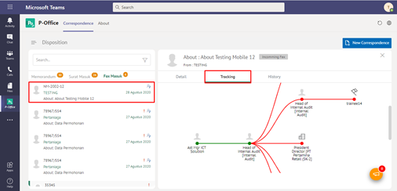

**Role yang sesuai**

- *Approver User*
- *Reviewer User*
- *Member User* (Pekerja)
- Sekretaris

*User* dapat melihat informasi lengkap fax masuk termasuk *preview* fax masuk, detail fax masuk, *tracking* fax masuk dan *history* fax masuk. 

## **P-Office Versi Web**

Langkah - langkah untuk melihat informasi fax masuk via Web adalah sebagai berikut :

1. Klik menu **Inbox/Draft/Outbox** dan pilih tab **Fax Masuk.** Pilih salah satu fax masuk yang akan dilihat informasinya

 

#### **Preview Fax Masuk**

Pada tab **Preview**, ditampilkan *preview* fax masuk yang merupakan hasil unggahan yang diinputkan oleh sekretaris/konseptor

 

#### **Detail Fax Masuk**

Pada tab **Detail**, terdapat informasi asal surat, perihal, file lampiran, kategori surat, resume, rekomendasi, nomor surat, klasifikasi surat, tanggal surat dan tujuan.

 

#### **Tracking Fax Masuk**

Pada tab **Tracking**, ditampilkan informasi *tracking* fax masuk dalam bentuk *chart*

 

#### **History Fax Masuk**

Pada tab **History**, ditampilkan riwayat fax masuk yang terdapat informasi jabatan, tanggal, tindakan dan komentar

 

## **P-Office Versi Teams**

Langkah - langkah untuk melihat informasi fax masuk via Teams adalah sebagai berikut:

1. Klik menu **Inbox/Draft/Outbox** dan pilih tab **Fax Masuk.** Pilih salah satu fax masuk yang akan dilihat informasinya

#### **Preview Fax Masuk**

Pada tab **Preview**, ditampilkan *preview* fax masuk yang merupakan hasil unggahan yang diinputkan oleh sekretaris/konseptor

#### **Detail Fax Masuk**

Pada tab **Detail**, terdapat informasi asal surat, perihal, file lampiran, kategori surat, resume, rekomendasi, nomor surat, klasifikasi surat, tanggal surat dan tujuan.

#### **Tracking Fax Masuk**

Pada tab **Tracking**, ditampilkan informasi *tracking* fax masuk dalam bentuk *chart*

#### **History Fax Masuk**

Pada tab **History**, ditampilkan riwayat fax masuk yang terdapat informasi jabatan, tanggal, tindakan dan komentar

## **P-Office Versi Android**

Langkah-langkah untuk melihat informasi fax masuk adalah sebagai berikut :

1. Klik menu **Inbox/Draft/Outbox** dan pilih tab **Fax masuk**

 

2. Pilih salah satu fax masuk yang akan dilihat informasinya

#### **Detail Fax Masuk**

Pada tab **Detail**, terdapat informasi asal surat, perihal, file lampiran, kategori surat, resume, rekomendasi, nomor surat, klasifikasi surat, tanggal surat dan tujuan.

#### **Preview Fax Masuk**

Pada tab **Preview**, ditampilkan _preview_ fax masuk yang merupakan hasil unggahan yang diinputkan oleh sekretaris/konseptor.

 

#### **History Fax Masuk**

Pada tab **History**, ditampilkan riwayat fax masuk yang terdapat informasi jabatan, tanggal, tindakan dan komentar

 

## **P-Office Versi IOS**

Langkah-langkah untuk melihat informasi fax masuk via IOS adalah sebagai berikut :

1. Klik menu **Inbox/Draft/Outbox** dan pilih tab **Fax masuk.** Pilih salah satu fax masuk yang akan dilihat informasinya

 

##### **Preview Fax Masuk**

Pada tab **Preview**, ditampilkan _preview_ fax masuk yang merupakan hasil unggahan yang diinputkan oleh sekretaris/konseptor.

##### **Detail Fax Masuk**

Pada tab **Detail**, terdapat informasi asal surat, perihal, file lampiran, kategori surat, resume, rekomendasi, nomor surat, klasifikasi surat, tanggal surat dan tujuan.

##### **History Fax Masuk**

Pada **History**, ditampilkan riwayat fax masuk yang terdapat informasi jabatan, tanggal, tindakan dan komentar

 