**Role yang sesuai**

- *Approver User*
- *Reviewer User*

*User* dapat melakukan *recall* / tarik disposisi fax masuk yang sudah dikirim kepada pejabat penerima disposisi. Fax masuk yang sudah dikirim ke pejabat penerima disposisi akan tersimpan di menu "**Outbox - Disposisi**" 

# **P-Office Versi Web**

Langkah - langkah untuk melakukan recall disposisi fax masuk via Web adalah sebagai berikut :

1. Klik menu **Outbox** dan pilih tab **Disposisi**

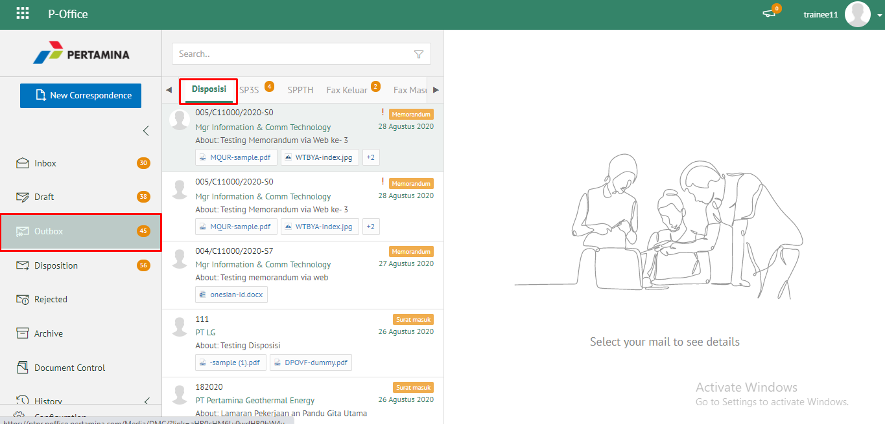 

2. Pilih fax masuk yang akan di-*recall* kemudian klik tab **Detail** kemudian klik **Recall**.
   
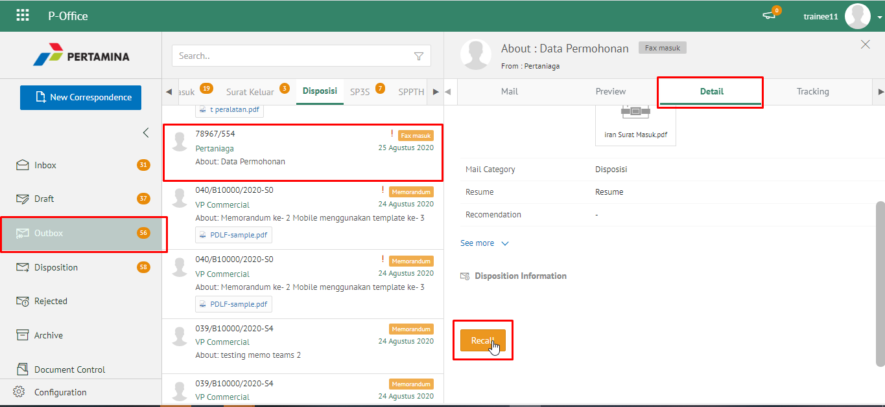 

3. Fax masuk yang sudah di-*recall* akan tersimpan di menu "**Draft - Disposisi**" penerima fax masuk / pendisposisi

## **P-Office Versi Teams**

Langkah - langkah untuk recall disposisi fax masuk via Teams adalah sebagai berikut: 

1. Klik menu **Outbox** dan pilih tab **Disposisi**

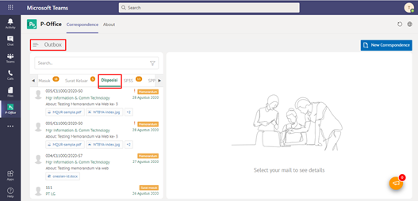

2. Pilih fax masuk yang akan di-*recall* kemudian klik tab **Detail** kemudian klik **Recall**.

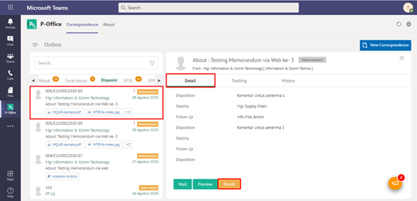

3. Fax masuk yang sudah di-*recall* akan tersimpan di menu "**Draft - Disposisi**" penerima fax masuk / pendisposisi

## **P-Office Versi Android**

Langkah-langkah untuk Recaall Fax masuk via Android adalah sebagai berikut :

1. Klik menu **Outbox** dan pilih tab **Disposisi**

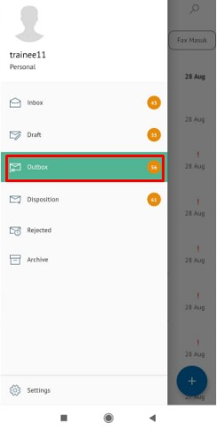 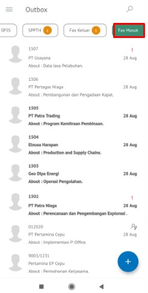

2. Pilih fax masuk yang akan di-_recall_ ,pada **Detail** pilih icon **Option** kemudian **_Recall_.**

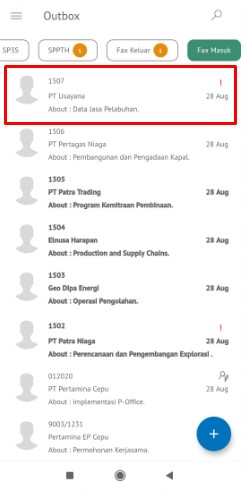 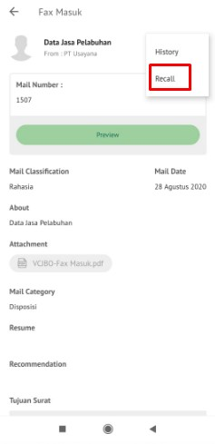

3. Sistem menampilkan pop up **Recall** lalu klik **Recall** Fax masuk yang sudah di-_recall_ akan tersimpan di menu “**Draft - Disposisi**” penerima fax masuk / pendisposisi

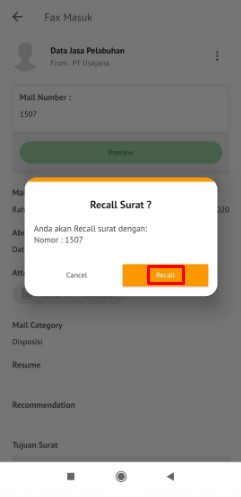

# **P-Office Versi Android**

Langkah-langkah untuk melakukan recall disposisi fax masuk IOS adalah sebagai berikut :

1. Klik menu **Outbox** dan pilih tab **Disposisi**

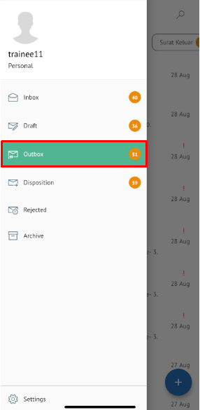 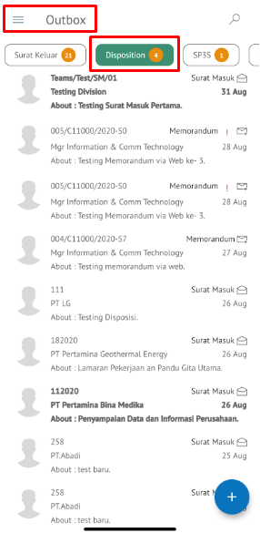 

2. Pilih fax masuk yang akan di-_recall_ kemudian klik icon **Option** kemudian klik **Recall**

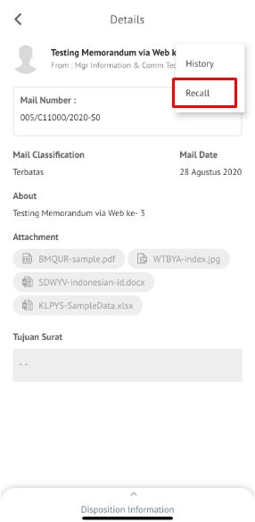

3. Fax masuk yang sudah di-_recall_ akan tersimpan di menu “**Draft - Disposisi**” penerima fax masuk / pendisposisi
