**Role yang sesuai**

- *Approver User*
- *Reviewer User*
- *Member User* (Pekerja)
- Sekretaris

*User* dapat menyelesaikan disposisi fax masuk jika *user* tidak akan melanjutkan untuk mendisposisikan fax masuk ke pejabat lain. 

## **P-Office Versi Web**

Langkah-langkah untuk menyelesaikan fax masuk Via Web adalah sebagai berikut :

1. Klik menu **Disposisi** dan pilih tab **Fax masuk**

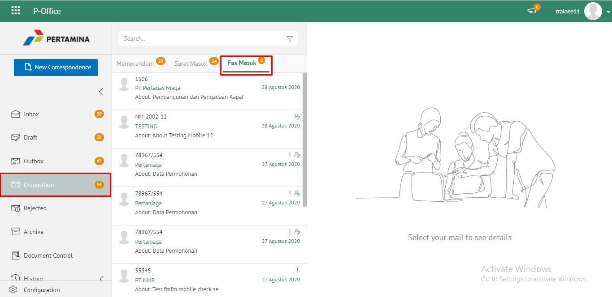 

2. Pilih disposisi yang akan diselesaikan kemudian pilih tab **Detail**

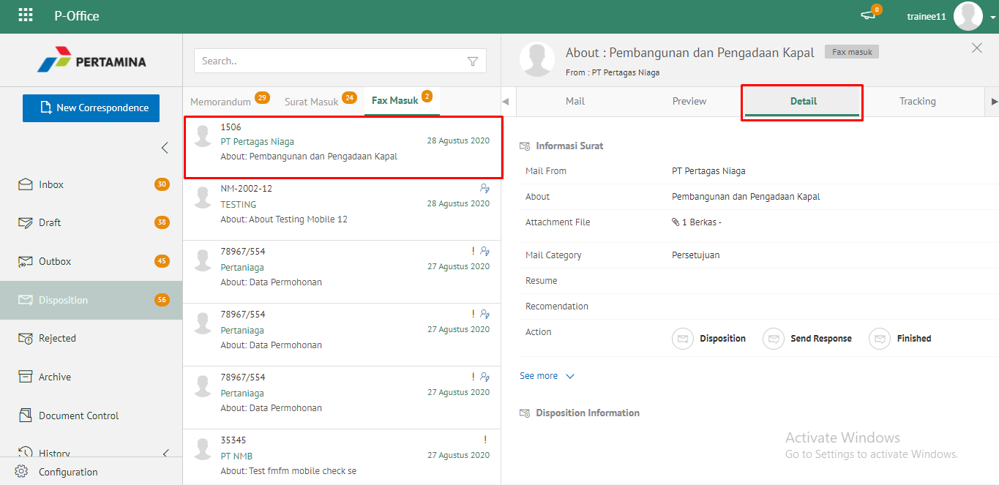 

3. Pilih tombol **Finish** kemudian klik **Send**

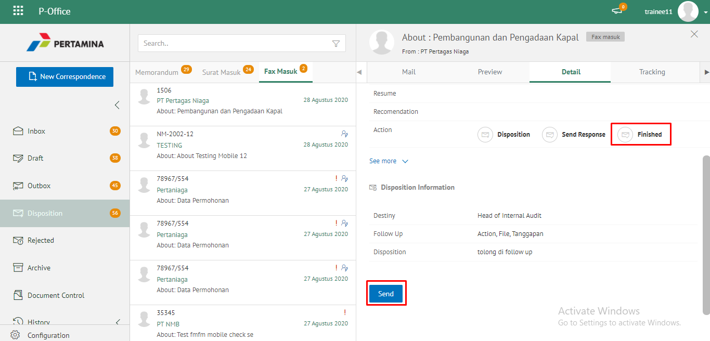 

4. Sistem menampilkan pop up konfirmasi dan *user* harus mengisi keterangan selesaikan disposisi kemudian klik **Save**.

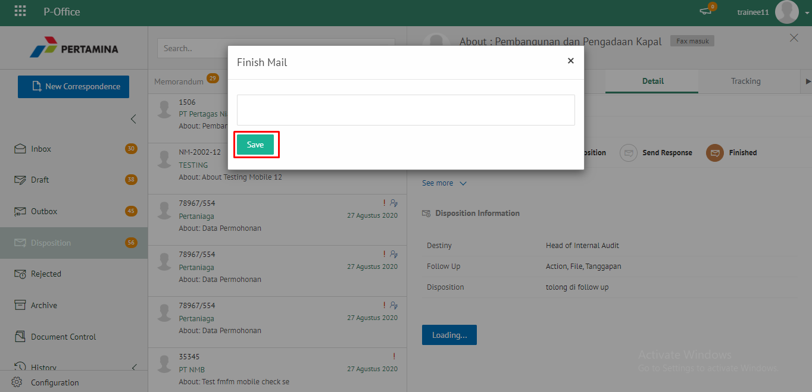 

5. Sistem menyimpan perubahan dan informasi selesai disposisi akan tersimpan di detail disposisi.

## **P-Office Versi Teams**

Langkah - langkah untuk menyelesaikan disposisi fax masuk via Teams adalah sebagai berikut:

1. Klik menu **Disposisi** dan pilih tab **Fax masuk**

2. Pilih disposisi yang akan diselesaikan kemudian pilih tab **Detail**

3. Pilih tombol **Finish** kemudian klik **Send**

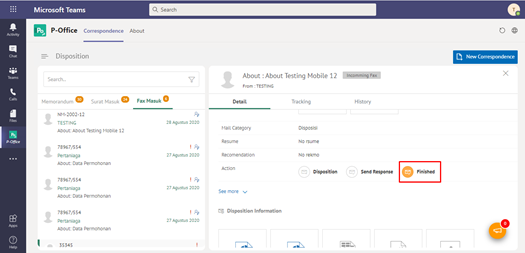

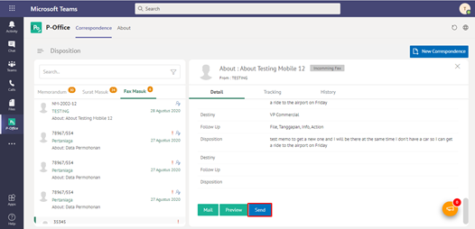

4. Sistem menampilkan pop up konfirmasi dan *user* harus mengisi keterangan selesaikan disposisi kemudian klik **Save**.

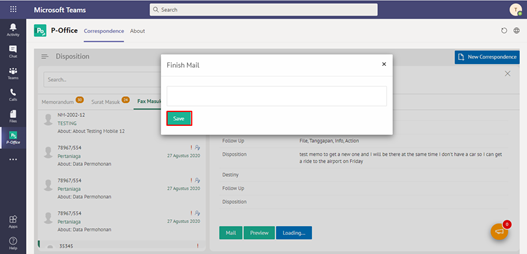

5. Sistem menyimpan perubahan dan informasi selesai disposisi akan tersimpan di detail disposisi.

## **P-Office Versi Android**

Langkah-langkah untuk menyelesaikan disposisi fax masuk via Android adalah sebagai berikut :

1. Klik menu **Disposisi** dan pilih tab **Fax masuk**

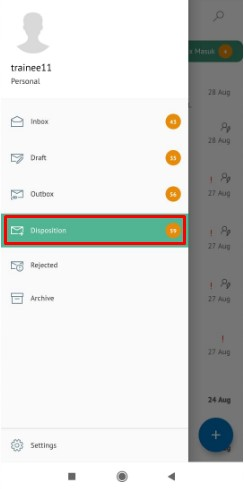 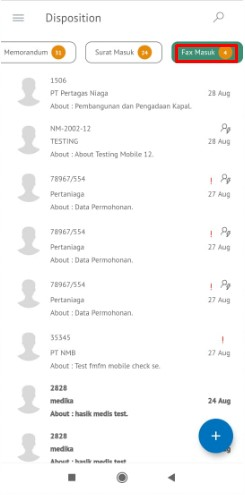 

2. Pilih disposisi yang akan diselesaikan kemudian pilih icon **Option**

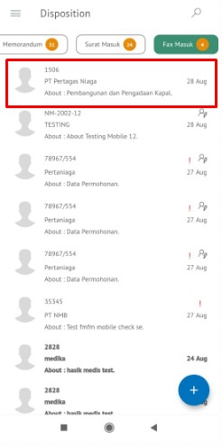 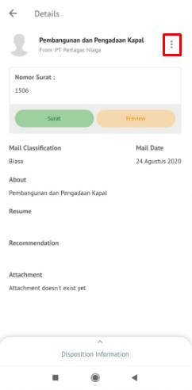 

3. Pilih tombol **Finish** kemudian Sistem menampilkan pop up konfirmasi dan _user_ harus mengisi keterangan selesaikan disposisi kemudian klik **Send**.

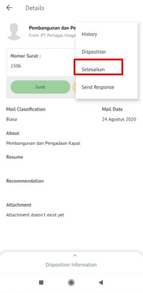 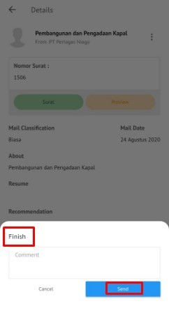 

4. Sistem menyimpan perubahan dan informasi selesai disposisi akan tersimpan di detail disposisi.

## **P-Office Versi IOS**

Langkah-langkah untuk menyelesaikan disposisi fax masuk via IOS adalah sebagai berikut :

1. Klik menu **Disposisi** dan pilih tab **Fax Masuk**

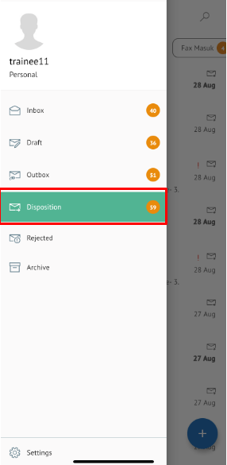 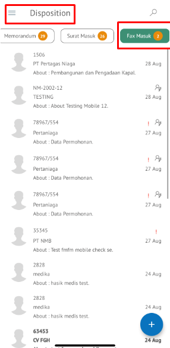

2. Pilih disposisi yang akan diselesaikan kemudian pilih icon **Option** dan pilih **Finish**

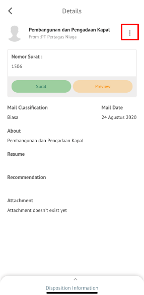 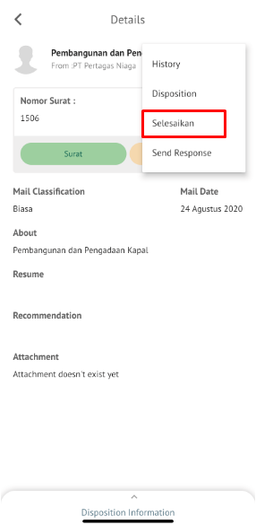 

3. Sistem menampilkan pop up konfirmasi dan _user_ harus mengisi keterangan selesaikan disposisi kemudian klik **Send**

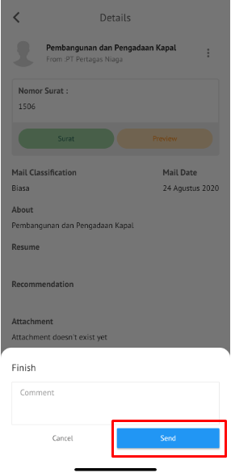

4. Sistem menyimpan perubahan dan informasi selesai disposisi akan tersimpan di detail disposisi.

