**Role yang sesuai**

- *Approver User*
- *Reviewer User*

*User* dapat menyelesaikan fax masuk jika *user* tidak akan melanjutkan untuk mendisposisikan fax masuk ke pejabat lain atau fax masuk selesai pada *user* tersebut. 

## **P-Office Versi Web**

Langkah-langkah untuk menyelesaikan fax masuk via Web adalah sebagai berikut :

1. Klik menu **Inbox** dan pilih tab **Fax Masuk**

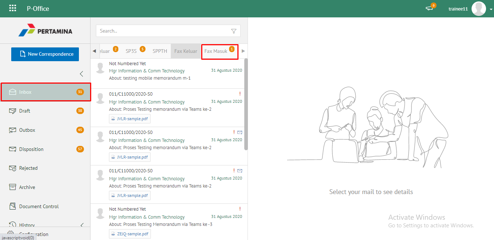 

2. Pilih fax masuk yang akan diselesaikan kemudian pilih tab **Detail**

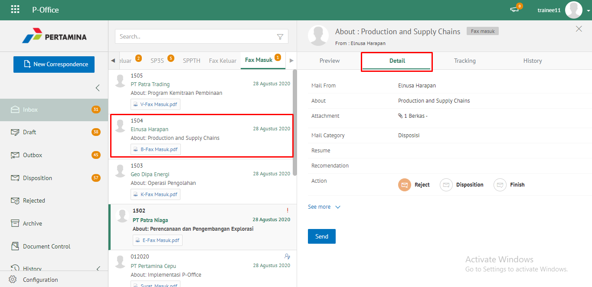 

3. Pilih tombol **Finish** kemudian klik **Send**

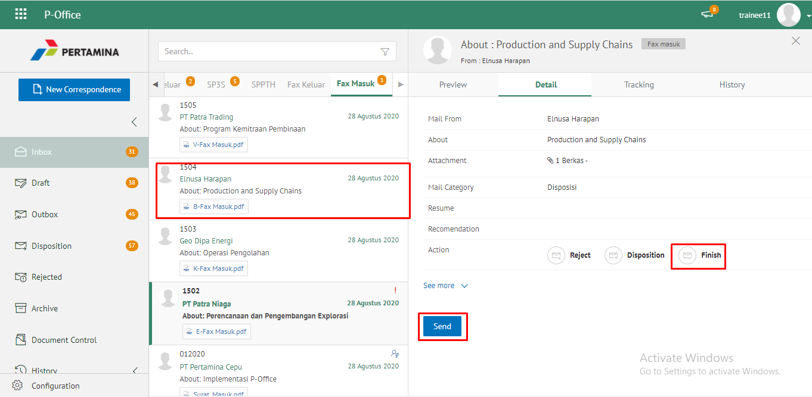 

4. Sistem menampilkan *pop up* konfirmasi dan *user* harus mengisi keterangan selesaikan disposisi kemudian klik **Save**.

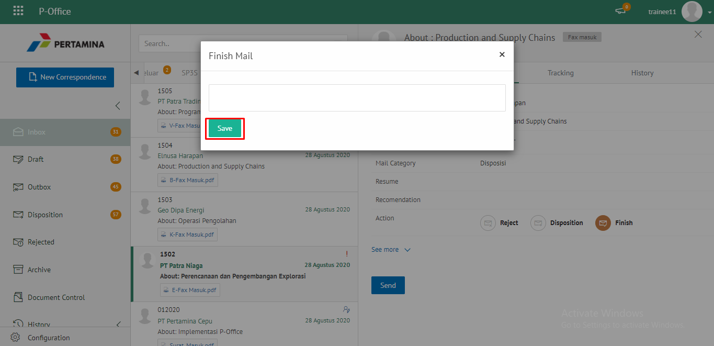

5. Sistem menyimpan perubahan dan informasi selesai disposisi akan tersimpan di detail disposisi.

## **P-Office Versi Teams**

Langkah - langkah untuk selesaikan fax masuk via Teams adalah sebagai berikut:

1. Klik menu **Inbox** dan pilih tab **Fax Masuk**

2. Pilih fax masuk yang akan diselesaikan kemudian pilih tab **Detail**

3. Pilih tombol **Finish** kemudian klik **Send**

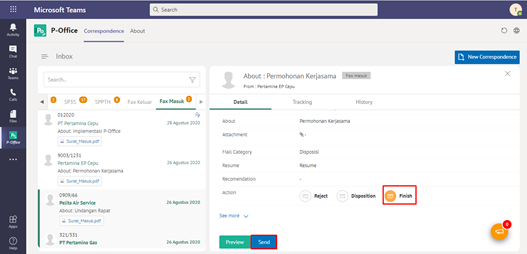

4. Sistem menampilkan *pop up* konfirmasi dan *user* harus mengisi keterangan selesaikan disposisi kemudian klik **Save**.

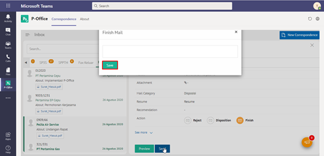

5. Sistem menyimpan perubahan dan informasi selesai disposisi akan tersimpan di detail disposisi.

## **P-Office Versi Android**

Langkah-langkah untuk menyelesaikan fax masuk via Android adalah sebagai berikut :

1. Klik menu **Inbox** dan pilih tab **Fax Masuk**

 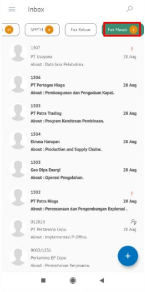

2. Pilih fax masuk yang akan diselesaikan kemudian pilih icon **Option**

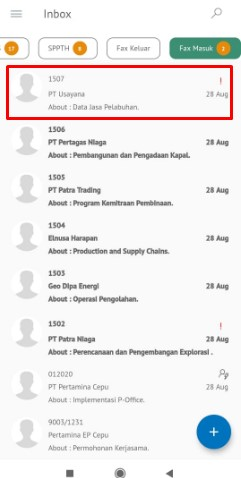 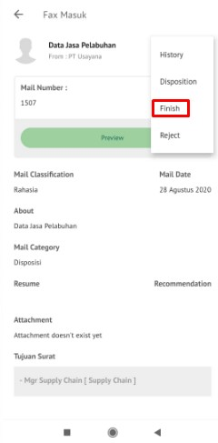

4. Pilih tombol **Finish** kemudian sistem menampilkan _pop up_ konfirmasi dan _user_ harus mengisi keterangan selesaikan disposisi kemudian klik **Send**

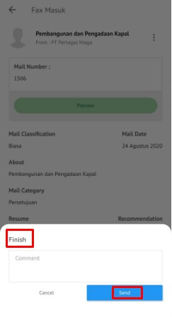

## **P-Office Versi IOS**

Langkah-langkah untuk menyelesaikan fax masuk via IOS adalah sebagai berikut :

1. Klik menu **Inbox** dan pilih tab **Fax Masuk**

 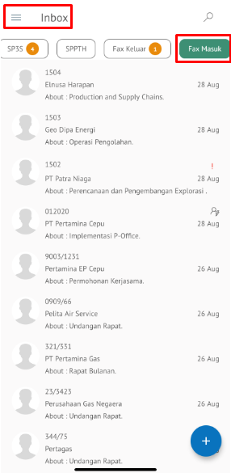

2. Pilih fax masuk yang akan diselesaikan kemudian pilih icon **Option** dan pilih **Finish**

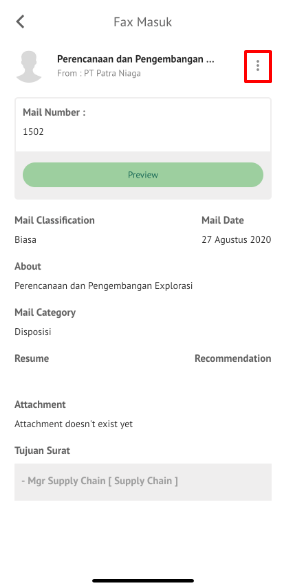 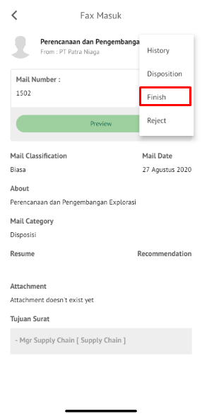

3. Sistem menampilkan _pop up_ konfirmasi dan _user_ harus mengisi keterangan selesaikan disposisi kemudian klik **Send**

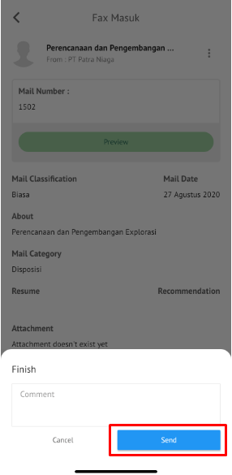

4. Sistem menyimpan perubahan dan informasi selesai disposisi akan tersimpan di detail disposisi
