**Role yang sesuai**

- Sekretaris

Sekretaris dapat menambah fax masuk pada aplikasi P-Office. 

## **P-Office Versi Web**

Langkah - langkah untuk menambah fax masuk via Web adalah sebagai berikut :

1. Klik menu **New Correspondence**

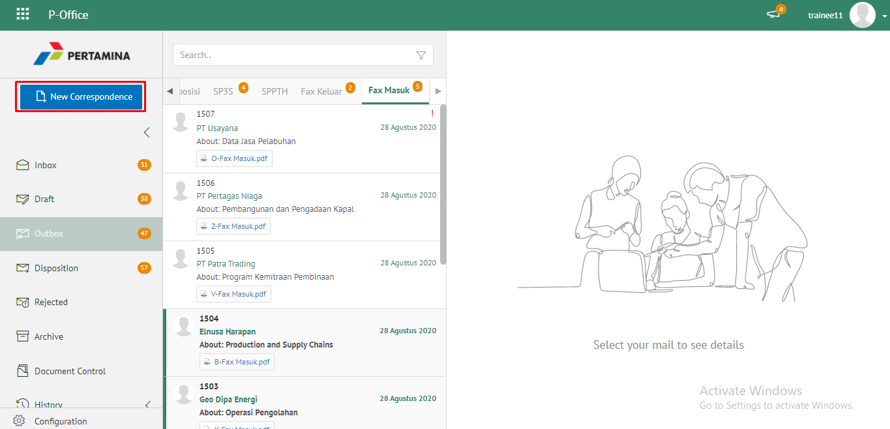 

2. Pilih jenis surat "**Fax Masuk**"

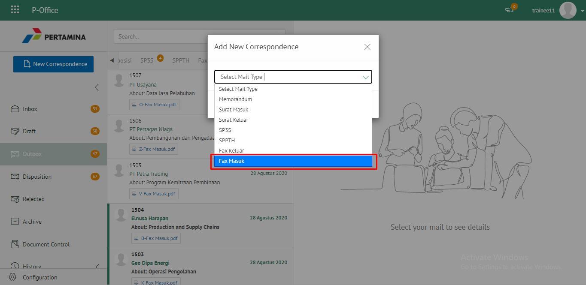 

3. Isi form tambah fax masuk. Klik **Simpan** untuk menyimpan form surat dan surat akan tersimpan di menu **"Draft - Fax Masuk"**. Klik **Simpan** untuk mengirim fax masuk dan fax masuk akan tersimpan di menu **"Outbox - Fax Masuk"**

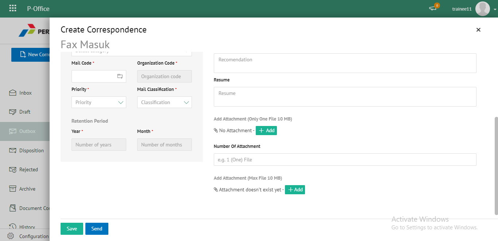   

4. Sistem berhasil menyimpan perubahan 

## **P-Office Versi Teams**

Langkah - langkah untuk tambah fax masuk via Teams adalah sebagai berikut:

1. Klik menu **New Correspondence**

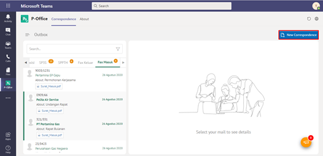

2. Pilih jenis surat "**Fax Masuk**"

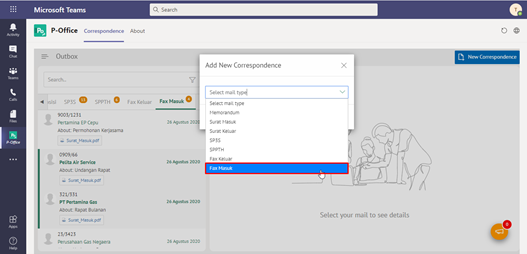

3. Isi form tambah fax masuk. Klik **Save** untuk menyimpan form surat dan surat akan tersimpan di menu **"Draft - Fax Masuk"**. Klik **Send** untuk mengirim fax masuk dan fax masuk akan tersimpan di menu **"Outbox - Fax Masuk"**

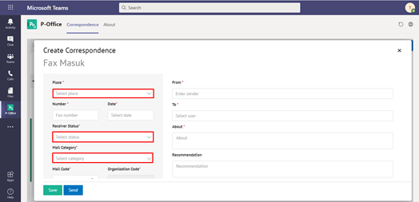

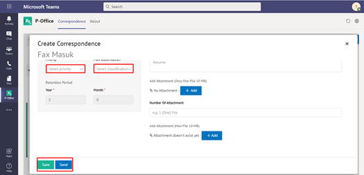

4. Sistem berhasil menyimpan perubahan

## **P-Office Versi Android**

Langkah-langkah untuk menambah fax masuk via Android adalah sebagai berikut :

1. Klik menu ikon **(+)** pada fax masuk

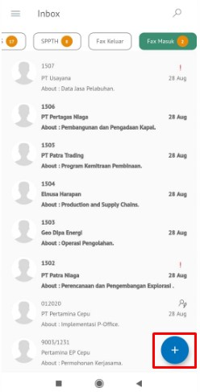

2. Pilih jenis surat “**Fax Masuk**” lalu **Next**

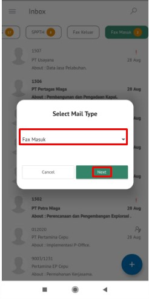

3. Isi form tambah fax masuk. Klik **Save Mail** untuk menyimpan form surat dan surat akan tersimpan di menu “**Draft – Fax Masuk**”. Klik **Send Mail** untuk mengirim fax masuk dan fax masuk akan tersimpan di menu “**Outbox – Fax Masuk**”

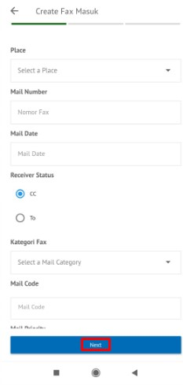 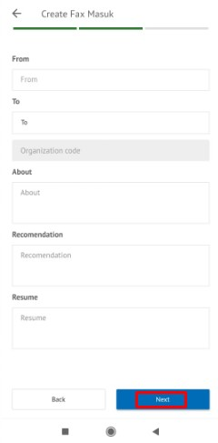

4. Sistem berhasil menyimpan perubahan pada fax masuk

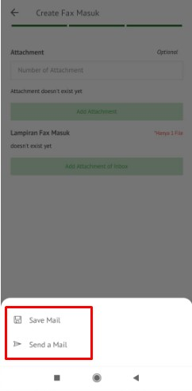

## **P-Office Versi IOS**

Langkah-langkah untuk menambah fax masuk via IOS adalah sebagai berikut :

1. Klik menu **New Correspondence**

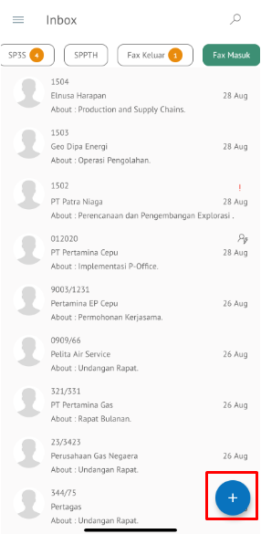

2. Pilih jenis surat “**Fax Masuk**”

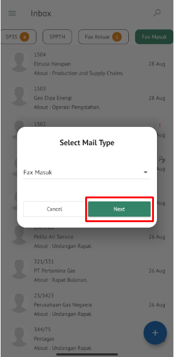

3. Isi form tambah fax masuk kemudian Klik **Next** untuk melanjutkan pengisian fax masuk

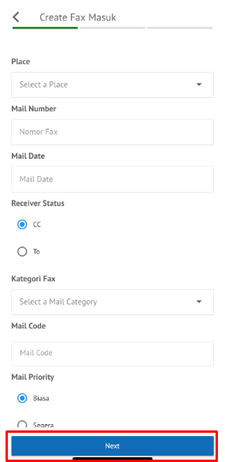 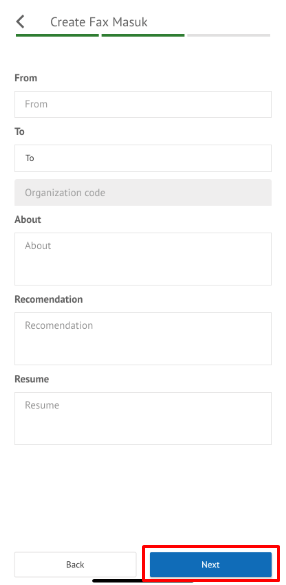

4. Klik **Save Mail** untuk menyimpan form surat dan surat akan tersimpan di menu “**Draft – Fax Masuk**”. Klik **Send Mail** untuk mengirim fax masuk dan fax masuk akan tersimpan di menu “**Outbox – Fax Masuk**”

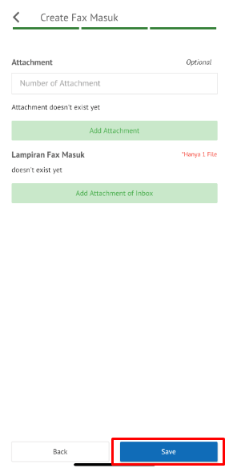 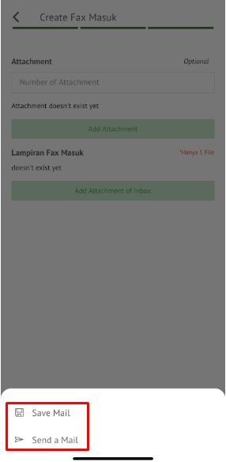

5. Sistem berhasil menyimpan perubahan

