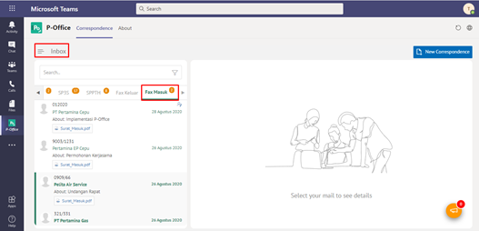
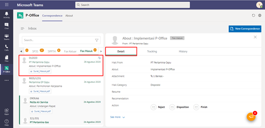
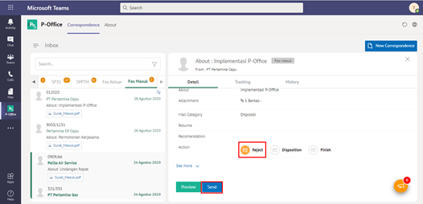
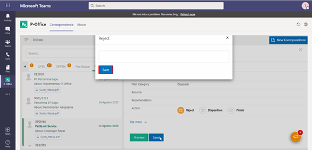

**Role yang sesuai**

- *Approver User* (Pemilik KBO)

Langkah - langkah untuk menolak fax masuk adalah sebagai berikut

1. Klik menu **Inbox** dan pilih tab **Fax Masuk**

2. Pilih fax masuk yang akan ditolak kemudian pilih tab **Detail**

3. Klik tombol **Tolak** dan pilih **Send.** Isikan komentar jika diperlukan

4. Sistem menampilkan *pop up* konfirmasi dan *user* harus mengisi keterangan tolak fax masuk kemudian klik **Tolak Fax**.

5. Sistem menyimpan perubahan dan informasi tolak fax masuk. Fax masuk yang sudah ditolak akan tersimpan di menu **Rejected - Fax Masuk**.

## **P-Office Versi Teams**

Langkah - langkah untuk tolak fax masuk via Teams adalah sebagai berikut:

1. Klik menu **Inbox** dan pilih tab **Fax Masuk**

2. Pilih fax masuk yang akan ditolak kemudian pilih tab **Detail**

3. Klik tombol **Reject** dan pilih **Send.** Isikan komentar jika diperlukan

4. Sistem menampilkan *pop up* konfirmasi dan *user* harus mengisi keterangan tolak fax masuk kemudian klik **Reject Fax**.

5.	Sistem menyimpan perubahan dan informasi tolak fax masuk. Fax masuk yang sudah ditolak akan akan terhapus dari aplikasi akan tersimpan di menu **“Rejected – Memorandum”** user penolak dengan label **Rejected**.

## **P-Office Versi Android**

Langkah-langkah untuk menolak fax masuk adalah sebagai berikut :

1. Klik menu **Inbox** dan pilih tab **Fax Masuk**

 

2. ilih fax masuk yang akan ditolak kemudian pilih ikon **tombol button**

 

3. Klik tombol **Reject** kemudian sistem menampilkan _pop up_ konfirmasi dan _user_ harus mengisi keterangan tolak fax masuk kemudian klik **Send**

4. Sistem menyimpan perubahan dan informasi tolak fax masuk. Fax masuk yang sudah ditolak akan akan tersimpan di menu **Rejected-Fax Masuk**
