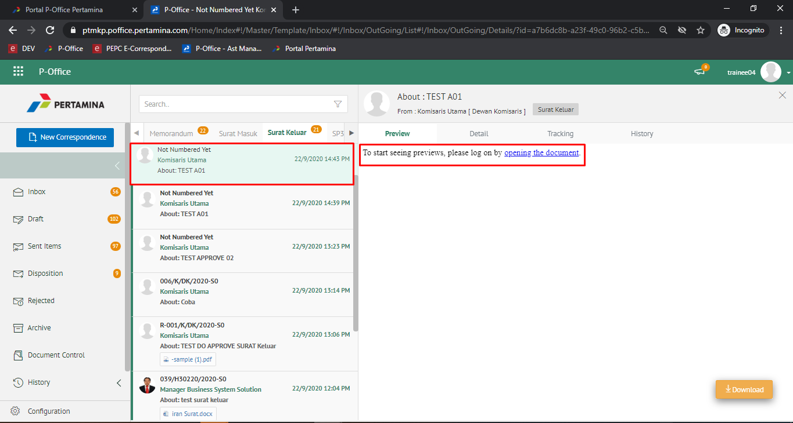
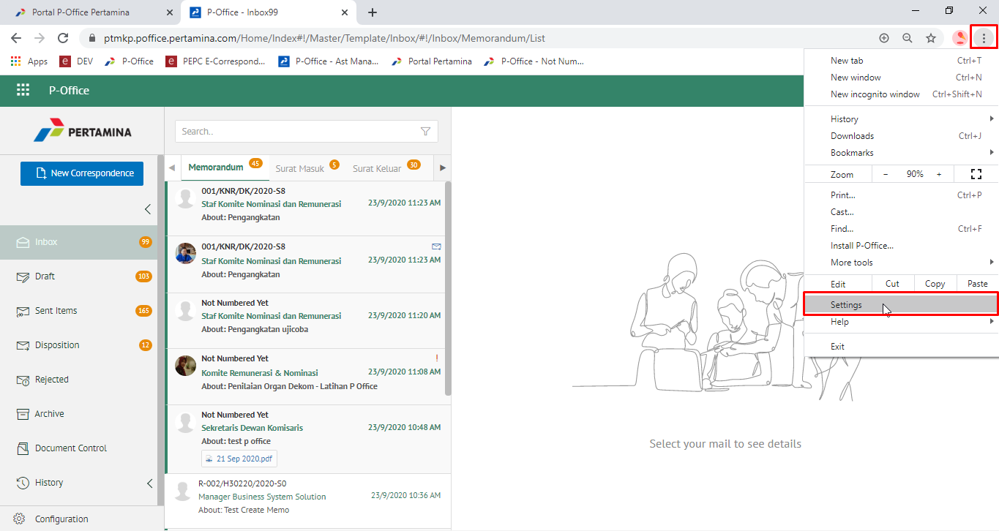
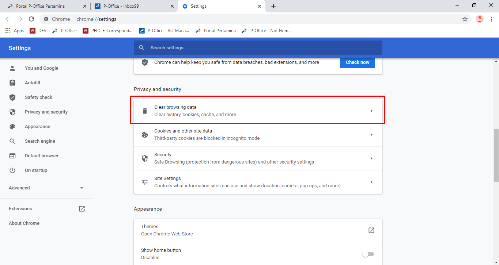
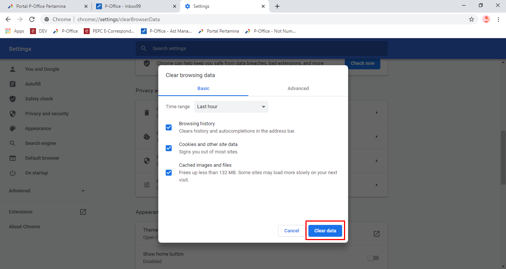
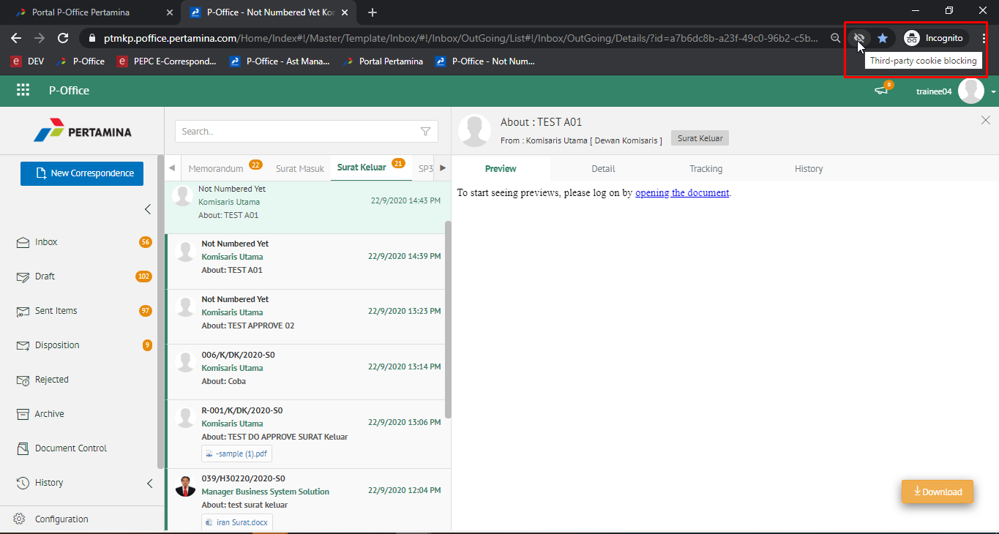
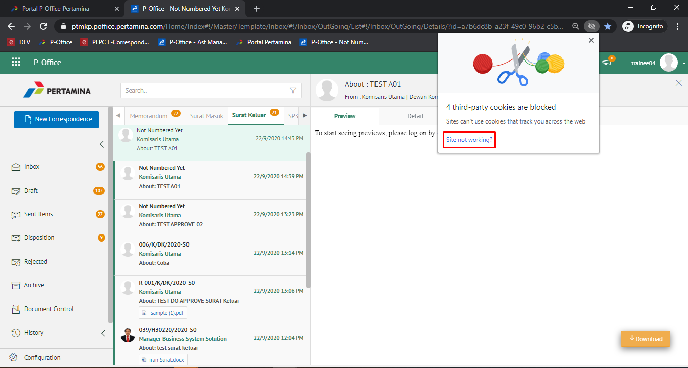
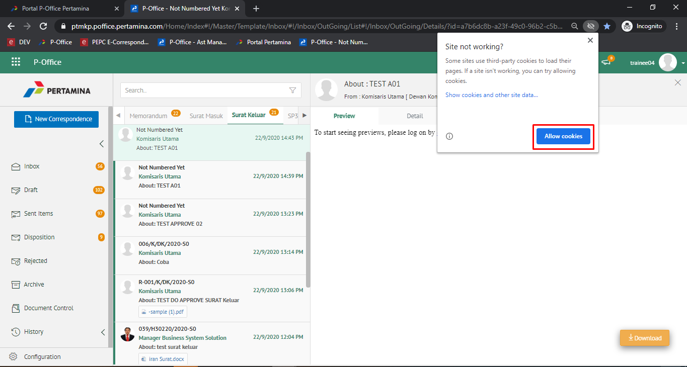
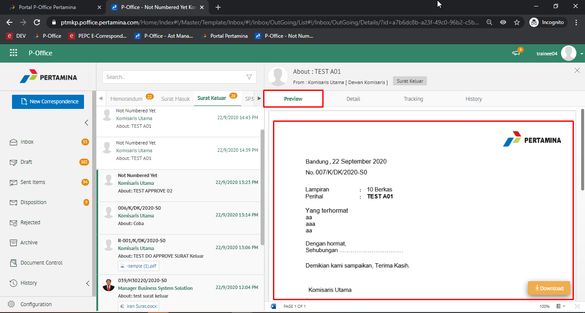

- Ketika Anda membuka preview dan tidak tampil dokumen previewnya dengan tampilan seperti bawah ini

- Lakukan *clear data* pada browser Anda dengan pilih tab **Option** kemudian pilih **Settings**

- Pada bagian **Privacy and security**, pilih **Clear browsing data**

- Checklist data yang ingin Anda hapus termasuk history, cookies dan cache pada browser Anda, kemudian pilih Clear data 

- Pastikan **Ad-Block** Anda sudah di-set menjadi **Allow** untuk dapat menampilkan preview dokumen. Klik *address bar* dan pilih **Third-party cookie blocking**

- Pilih **site not working?**

- Klik **Allow Cookies**

- Kemudian *refresh* laman P-Office Anda dan pilih surat yang akan Anda lihat previewnya 

