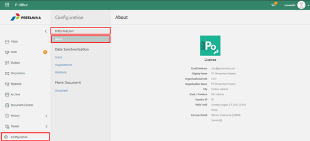

**Role yang sesuai**

- IT Admin

IT Admin dapat melihat informasi aplikasi. Langkah - langkah untuk melihat informasi aplikasi adalah sebagai berikut:

1.    Pilih menu **Configuration** dan pilih submenu **Information - About**
      

2.    Sistem akan menampilkan informasi aplikasi antara lain alamat email, display name, unit organisasi, nama organisasi, kota, provinsi, country ID, valid licensi detail dan lisensi
