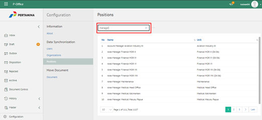
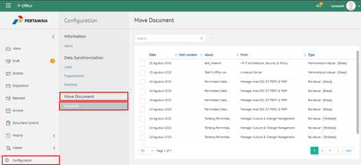

**Role yang sesuai**

- IT Admin

IT Admin dapat mengelola jabatan pada aplikasi eCorr yang sudah didaftarkan pada manajemen user. Informasi yang ditampilkan yaitu nama jabatan dan unit organisasi. Pengelolaan jabatan yang dilakukan oleh admin eCorr antara lain yaitu:

- Melihat daftar jabatan pada aplikasi
- Mencari daftar jabatan pada aplikasi

#### **Melihat Daftar Jabatan pada Aplikasi**

1.    Pilih menu **Configuration** dan pilih submenu **Syncronization - Position**

2.    Sistem menampilkan daftar user pada aplikasi eCorr

#### **Mencari Jabatan pada Aplikasi**

1.    Pilih menu **Configuration** dan pilih submenu **Syncronization - Position**

2.    Ketikkan kata kunci pada kolom pencarian kemudian klik **Enter**

3.    Sistem menampilkan hasil pencarian berdasarkan kata kunci
