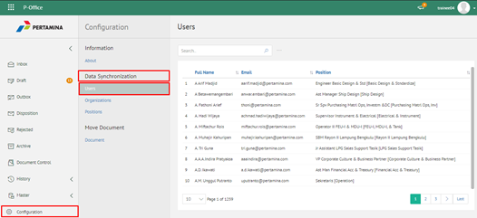
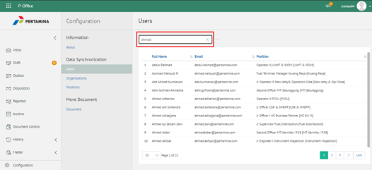

**Role yang sesuai**

- IT Admin

IT Admin dapat mengelola notifikasi email yang dikirimkan kepada pengirim. Langkah - langkah untuk mengirimkan notifikasi email terkait perubahan aplikasi adalah sebagai berikut:

1. Pilih menu **Configuration** dan pilih submenu **Information - System**

2. Ketikkan nama pengirim pada kolom **Sender** dan checklist **Yes** pada bagian **Mail Notification** kemudian klik **Submit** untuk mengirimkan notifikasi ke email user

3. Sistem berhasil mengirimkan email notifikasi ke tujuan

