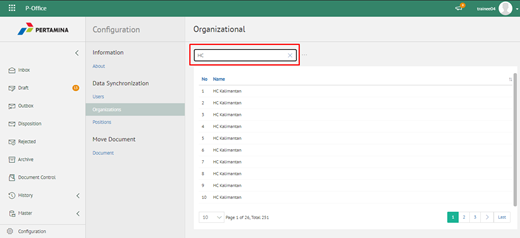
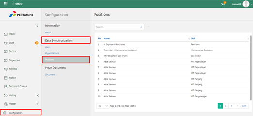

**Role yang sesuai**

- IT Admin

IT Admin dapat mengelola unit organisasi pada aplikasi eCorr yang sudah didaftarkan di idProo. Informasi yang ditampilkan yaitu nama unit organisasi. Pengelolaan unit organisasi yang dilakukan oleh admin eCorr antara lain yaitu:

- Melihat daftar unit organisasi pada aplikasi
- Mencari daftar unit organisasi pada aplikasi

#### **Melihat Daftar Unit Organisasi pada Aplikasi**

1. Pilih menu **Configuration** dan pilih submenu **Syncronization - Organization**

2. Sistem menampilkan daftar user pada aplikasi eCorr. Admin eCorr juga dapat melihat daftar unit kerja dalam bentuk hirarki dengan klik pada icon **Tree**

3. Sistem menampilkan unit organisasi dalam bentuk hirarki

#### **Mencari Unit Organisasi pada Aplikasi**

1. Pilih menu **Configuration** dan pilih submenu **Syncronization - Organization**

2. Ketikkan kata kunci pada kolom pencarian kemudian klik **Enter**

3. Sistem menampilkan hasil pencarian berdasarkan kata kunci
