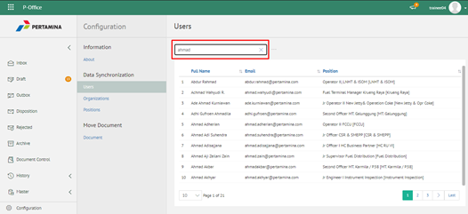

**Role yang sesuai**

- IT Admin

IT Admin dapat mengelola user pada aplikasi P-Office yang sudah didaftarkan pada sistem manajemen user. Informasi yang ditampilkan yaitu nama, alamat email dan no telepon. Pengelolaan user yang dilakukan oleh admin P-Office antara lain adalah sebagai berikut :

- Melihat daftar user pada aplikasi
- Mencari daftar user pada aplikasi

## **P-Office Versi Web**

Langkah - langkah untuk melihat daftar user pada aplikasi P-Office via Web adalah sebagai berikut:

####  **Melihat Daftar User pada Aplikasi**

1. Pilih menu **Configuration** dan pilih submenu **Syncronization - Users**

2. Sistem menampilkan daftar user pada aplikasi P-Office

#### **Mencari User pada Aplikasi**

1. Pilih menu **Configuration** dan pilih submenu **Syncronization - Users**

2. Ketikkan kata kunci pada kolom pencarian kemudian klik **Enter**

3. Sistem menampilkan hasil pencarian berdasarkan kata kunci
