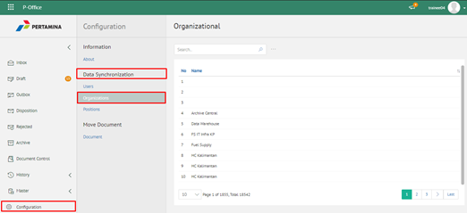
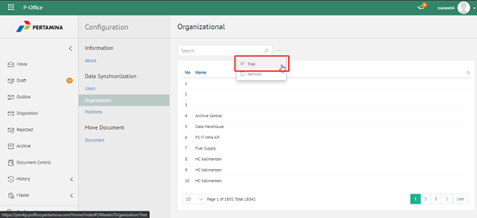

**Role yang sesuai**

- IT Admin

IT Admin dapat mengelola user pada aplikasi eCorr yang sudah didaftarkan pada sistem manajemen user. Informasi yang ditampilkan yaitu nama, alamat email dan no telepon. Pengelolaan user yang dilakukan oleh admin eCorr antara lain yaitu:

- Melihat daftar user pada aplikasi
- Mencari daftar user pada aplikasi

####  **Melihat Daftar User pada Aplikasi**

1. Pilih menu **Configuration** dan pilih submenu **Syncronization - Users**

2. Sistem menampilkan daftar user pada aplikasi eCorr

#### **Mencari User pada Aplikasi**

1. Pilih menu **Configuration** dan pilih submenu **Syncronization - Users**

2. Ketikkan kata kunci pada kolom pencarian kemudian klik **Enter**

3. Sistem menampilkan hasil pencarian berdasarkan kata kunci
