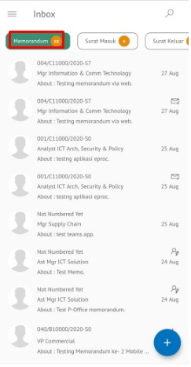

**Role yang sesuai**

- *Approver User*
- *Reviewer User*

*User* dapat melakukan *custom* penerima disposisi terhadap pejabat penerima yang akan menerima perintah disposisi. Secara *default* pejabat yang akan menerima disposisi adalah pejabat yang ada dibawahnya. Tetapi terdapat *case* jika *user* membutuhkan *custom* penerima disposisi sehingga disediakan fitur untuk memilih pejabat selain pejabat yang ada dibawahnya.

## **P-Office Versi Web**

Langkah-langkah untuk melakukan Custom disposisi memorandum via Web adalah sebagai berikut

1. Klik menu **Inbox** dan pilih tab **Memorandum**

2. Pilih memorandum yang akan didisposisikan kemudian pilih tab **Detail**

3. Klik tombol **Disposition** dan pilih **Send**

4. Sistem menampilkan form disposisi. Klik icon "+" pada field **Forward To**. Isikan informasi disposisi dan perintah untuk masing-masing penerima disposisi.

5. Sistem menampilkan daftar pejabat yang dapat dipilih untuk didisposikan

6. Isikan perintah dan keterangan pada masing - masing penerima disposisi. Tambahkan lampiran disposisi jika diperlukan. Fitur **Save Comment For All Untuk Semua** dapat digunakan *user* untuk memberikan komentar yang sama untuk masing-masing pejabat penerima disposisi. Klik **Save** untuk menyimpan perubahan dan klik **Send** untuk mengirim disposisi.

## **P-Office Versi Teams**

Langkah-langkah untuk Custom disposisi Memorandum via Teams adalah sebagai berikut :

1. Klik menu **Inbox** dan pilih tab **Memorandum**

2. Pilih memorandum yang akan didisposisikan kemudian pilih tab **Detail**

3. Klik tombol **Disposition** dan pilih **Send**

4. Sistem menampilkan form disposisi. Klik icon "+" pada field **Forward To**. Isikan informasi disposisi dan perintah untuk masing-masing penerima disposisi.

5. Sistem menampilkan daftar pejabat yang dapat dipilih untuk didisposikan

6. Isikan perintah dan keterangan pada masing - masing penerima disposisi. Tambahkan lampiran disposisi jika diperlukan. Fitur **Save Comment For All Untuk Semua** dapat digunakan *user* untuk memberikan komentar yang sama untuk masing-masing pejabat penerima disposisi. Klik **Save** untuk menyimpan perubahan dan klik **Send** untuk mengirim disposisi.

## **P-Office Versi Android**

Langkah-langkah untuk Custom disposisi Memorandum via Android adalah sebagai berikut :

1. Klik menu **Inbox** dan pilih tab **Memorandum**

 

2. Pilih memorandum yang akan didisposisikan kemudian pilih icon **Option**

 

3. Klik tombol **Disposisi** kemudian sistem akan menampilkan form disposisi. Isikan informasi disposisi dan perintah untuk masing-masing penerima disposisi.

 

4. Sistem menampilkan form disposisi. Klik icon “+” pada field **Forward To**. Isikan informasi disposisi dan perintah untuk masing-masing penerima disposisi.

5. Sistem menampilkan daftar pejabat yang dapat dipilih untuk didisposikan

6. Isikan perintah dan keterangan pada masing-masing penerima disposisi. Tambahkan lampiran disposisi jika diperlukan. Fitur **Save Comment For All Untuk Semua** dapat digunakan _user_ untuk memberikan komentar yang sama untuk masing-masing pejabat penerima disposisi. Klik **Simpan** untuk menyimpan perubahan dan klik **Send** untuk mengirim disposisi.

## **P-Office Versi IOS**

Langkah-langkah untuk melakukan Custom disposisi memorandum via IOS adalah sebagai berikut :

1. Klik menu **Inbox** dan pilih tab **Memorandum**

 

2. Pilih memorandum yang akan didisposisikan kemudian pilih tab **Option** dan pilih **Disposition**

 

3. Sistem menampilkan form disposisi. Klik icon “**+ Add Disposition**” pada field **Forward To.** Isikan informasi disposisi dan perintah untuk masing-masing penerima disposisi

4. Sistem menampilkan daftar pejabat yang dapat dipilih untuk didisposikan kemudian klik **Submit**
   

5. Isikan perintah dan keterangan pada masing-masing penerima disposisi. Tambahkan lampiran disposisi jika diperlukan. Fitur **Same Comment For All** dapat digunakan _user_ untuk memberikan komentar yang sama untuk masing-masing pejabat penerima disposisi. Klik **Save** untuk menyimpan perubahan dan klik **Send** untuk mengirim disposisi.

